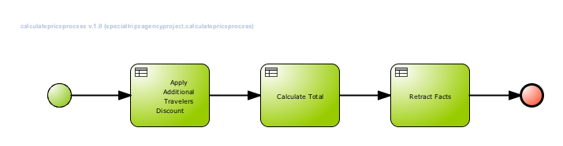
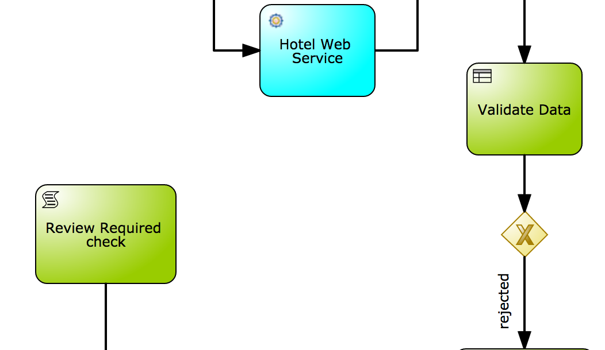
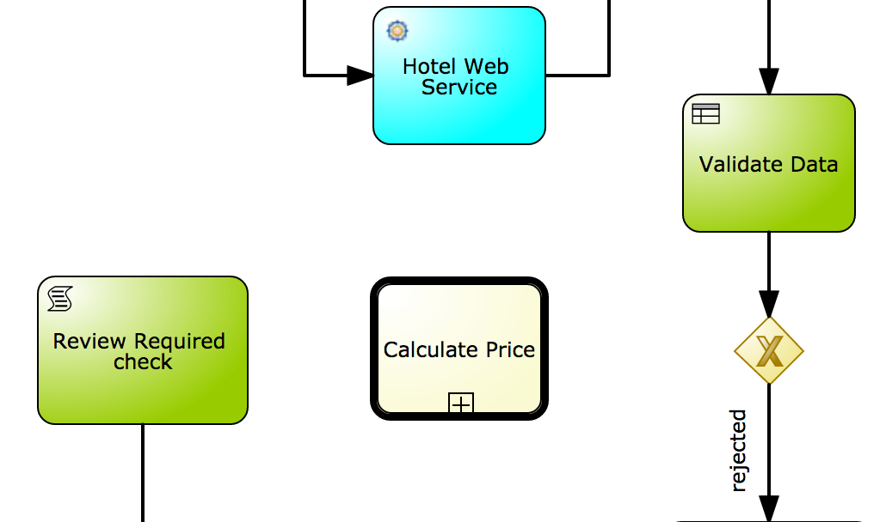
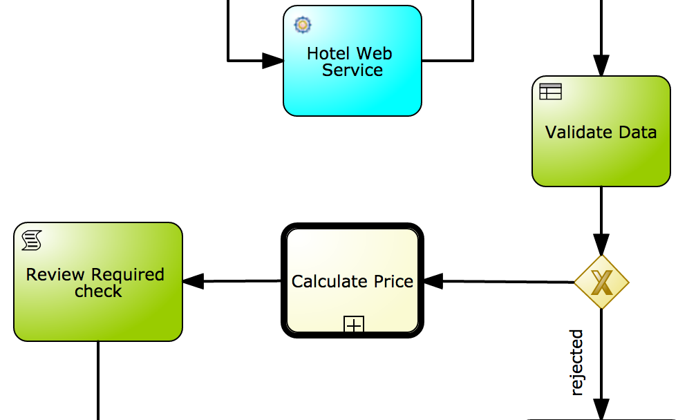
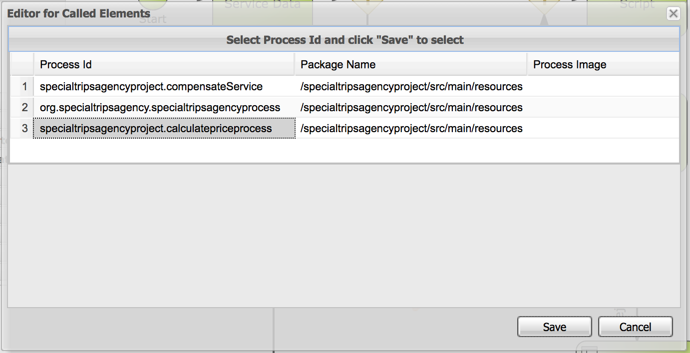

= JBoss BPMSuite 6.x Workshop Labs

== Lab 10: Implement SubProcess call

In this lab we will implementn call a (reusable) SubProcess from our main process.

=== Objectives
 
* Learn how to use the JBoss BPMSuite Subprocesses
* Learn how to map process data to subprocesses

== Introduction

BPMN2 processes can be composed of multiple processes. We can embed subprocess in the process definition of our main process, or we can re-use BPMN2 processes defined in th current project or defined in another projects. We call these processes _subprocesses_.

In our project we've already defined 2 processes that we use in our main process, the _calculatepriceprocess_ and the _compensateService_. In this lab we will add the _calculatepriceproces_ to our main process.

== Implementing the SubProcess node

[start=1]
. We're going to add the sub-process after the _Data-base Exclusive_ gateway when the data is not rejected. First we remove the connector between the gateway and the _Review Required check_.

[start=2]
. Add a _Reusable SubProcess_ node to the canvas and give it the name "Calculate Price". The _Reusable SubProcess_ node can be found under the _Subprocesses_ category in the palette.

[start=3]
. Connect the new _Reusable SubProcess_ node to the _Data-based Exclusive_ gateway and the _Review Required check_ script node.

[start=4]
. We first need to configure the subprocess to be called. Select the new _Reusable SubProcess_ node and open the properties panel on the right-hand-side of the editor. Click on the _Called Element_ field to open the _Called Elements_ editor. Select the _specialtripsagencyproject.calculatepriceprocess_ element and click "Save".

[start=5]
. We want to pass data from our main process to our subprocess. As with other nodes, this can be done via the _Assignments_ field in the properties of the node. This allows to configure the input and output data mappping of the subprocess. Select the new _Reusable SubProcess_ node and open the properties panel on the right-hand-side of the editor. Click on the _Assignments_ field to open the _Calculate Price Data I/O_ editor. Add the following data i/o assignments. Note that the assignments match the names of the process-variables in our subprocess. Because our subprocess modifies the `BookingObject`, we want to map that variable back to the process-variable of our main process.

.Data Input Assignments
|===
|Name |Data Type |Source

|applicant
|org.specialtripsagency.Applicant
|applicant

|bookingObject
|org.specialtripsagency.BookingObject
|bookingObject

|flight
|org.specialtripsagency.FLight
|flight

|hotel
|org.specialtripsagency.Hotel
|hotel
|===

.Data Output Assignments
|===
|Name |Data Type |Target

|bookingObject
|org.specialtripsagency.BookingObject
|bookingObject
|===

[start=6]
Validate the process and save it using the "Save" button in the upper-right corner of the editor.

== Conclusion

In this lab we've added a Sub Process (_calculatepriceprocess_) to our process, which will determine the price of our booking. We've added input and output data mappings that allow us to pass data to, and retrieve data from the subprocess.

In the next lab we will add a Human Task Form that allows users to interact with the process and it's data when the process is waiting on a human-task node.
