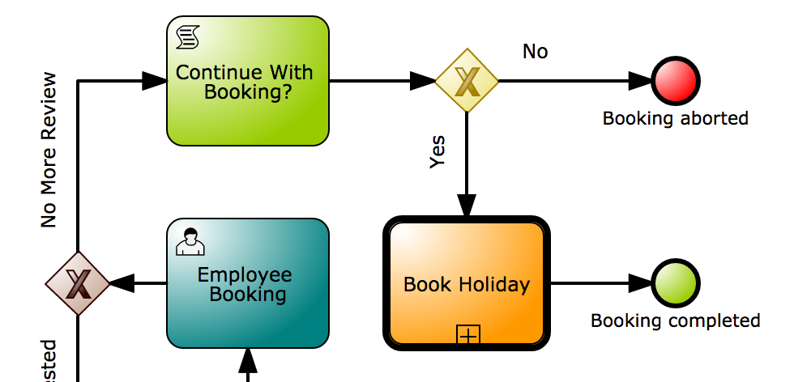
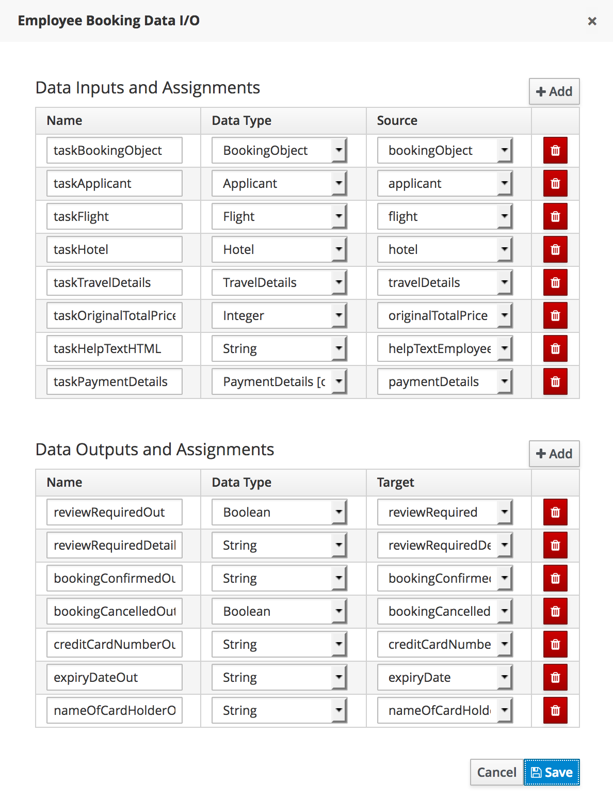
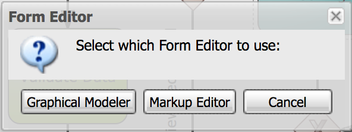
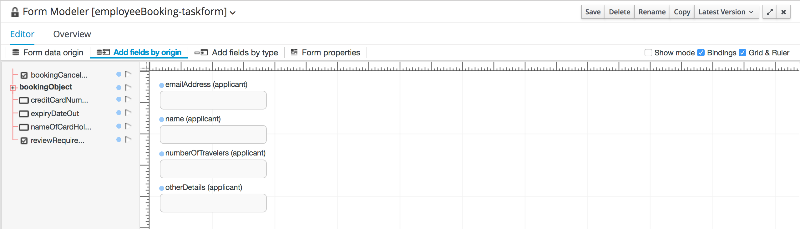
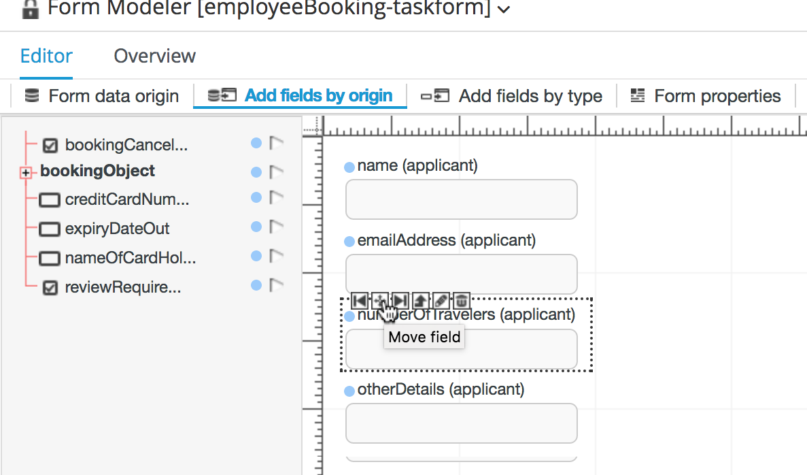
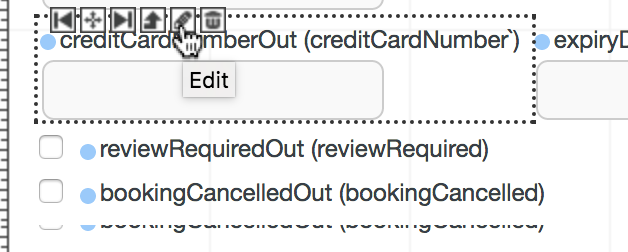
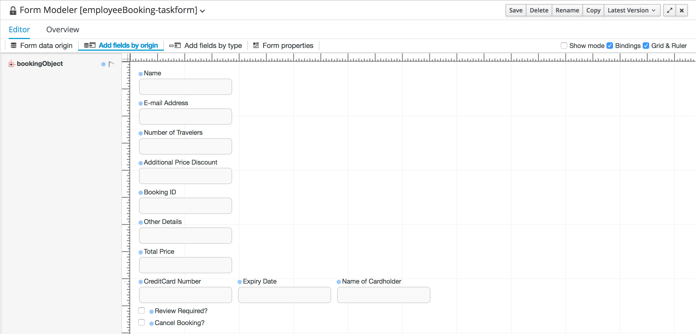

= JBoss BPMSuite 6.x Workshop Labs

== Lab 11: Create a Human Task Form

In this lab we will create a Human Task Form that allows users to interact with the process

=== Objectives
 
* Learn how to create a Human Task Form
* Learn how to link a Human Task Form to a human-task node in the process.
* Learn how to map process data to and from a human task.

== Introduction

BPMN2 allows to define human interaction within an automated process. Human interaction can be required at any point in an automated business process, for example to review the data in the process (is all the process data correct), make a human decison (should this applicant be reviewed by a specialist?), add additional process data (to complete the booking we need additional credit-card information), etc.

All these interactions ca be modelled with a human-task node. When the process instance hits such a node, it goes into a wait-state. The process instance will continue once the human-task has been completed.

Human-tasks can be assigned to an actor, a list of actors, a group and/or a list of groups.

The human-task that we will use in this lab has already been defined (including its data input and output mappings). The focus of this lab will be on implementing the form that allows us to interact with the human task via the Human Task Server.

== The Human Task

The human-task that we will use in this lab is the _Employee Booking_ human task. This human-task allows us to accept the booking (which requires us to add additional payment details), reject the booking or send the booking for review.

The human task already has it's data input and output mapping defined. We can use this data in our form.

== Implementing the Human Task Form

[start=1]
. To create the form for our human-task, click on the "Employee Booking" Human Task node, and click on the "Edit Task Form" button:

image:images/lab11-create-ht-form.png["Create Human Task Form.", 256]

This will open a pop-up box in which we need to select the type of editor we want to use. Select "Graphical Modeler":

[start=2]
. We first need to select which data we want to use in our form fields. In this list we can use the data we configured in the data input and output mapping of our human task node in our process definition. Add the following data:

.Form Modeler Data
|===
|Id |Input Id |Output Id |Type |Info |Rende color

|applicant
|taskApplicant
|
|From Data Model
|org.specialtripsagency.Applicant
|Blue

|bookingObject
|taskBookingObject
|
|From Data Model
|org.specialtripsagency.BookingObject
|Blue

|creditCardNumber
|
|creditCardNumberOut
|From Basic Type
|java.lang.String
|Blue

|expiryDate
|
|expiryDateOut
|From Basic Type
|java.langString
|Blue

|nameOfCardHolder
|
|nameOfCardHolderOut
|From Basic Type
|java.lang.String
|Blue

|reviewRequired
|
|reviewRequiredOut
|From Basic Type
|java.lang.Boolean
|Blue

|bookingCancelled
|
|bookingCancelledOut
|From Basic Type
|java.lang.Boolean
|Blue

|===

[start=3]
. Now that we've defined the data to be used in our form, we can start creating the form layout. Click on the "Add field by origin" tab, which will open the form editor. First add the _applicant_ data type to the form. Click on _applicant_ on the left-hand-side in the editor and click on the arrow icon. In the "Add all remaining data holder fields to form", click _OK_.

[start=4]
. Fields can be moved in the editor by selecting them and clicking on the _Move field_ button.

[start=5]
. Continue by adding the fields to the form until the form looks like this. Note that you can edit the fields and their properties by selecting a field and clicking on the "Edit" button. This allows to configure things like the _label_,_read-only_, _input-bindings_, _output-bindings_, etc. Inspect for example the input-binding on the _name_ field and the output-binding on the _creditCardNumberOut_ field.

[start=6]

. Save the form by clicking on the _Save_ button in the upper right of the editor.

== Conclusion

In this lab we've created a simple human task form that is linked to the _Employee Booking_ human task node in the process definition. We've seen how we can add data fields to the form definition, how we can bind input and output data to form fields and how to edit the properties of these fields.

In the next lab we will see how all the previous labs come together when we deploy and test our process.
