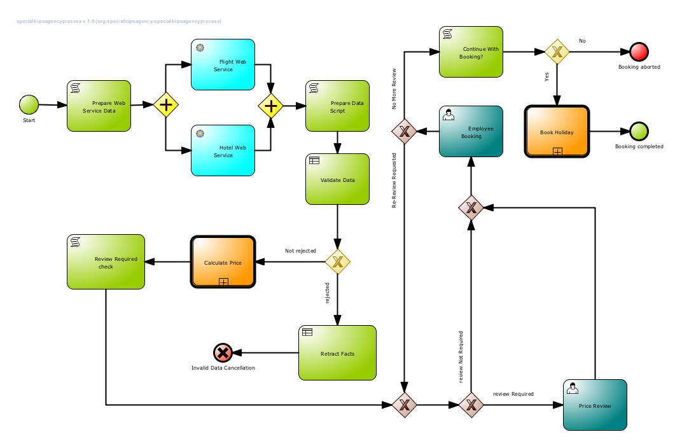
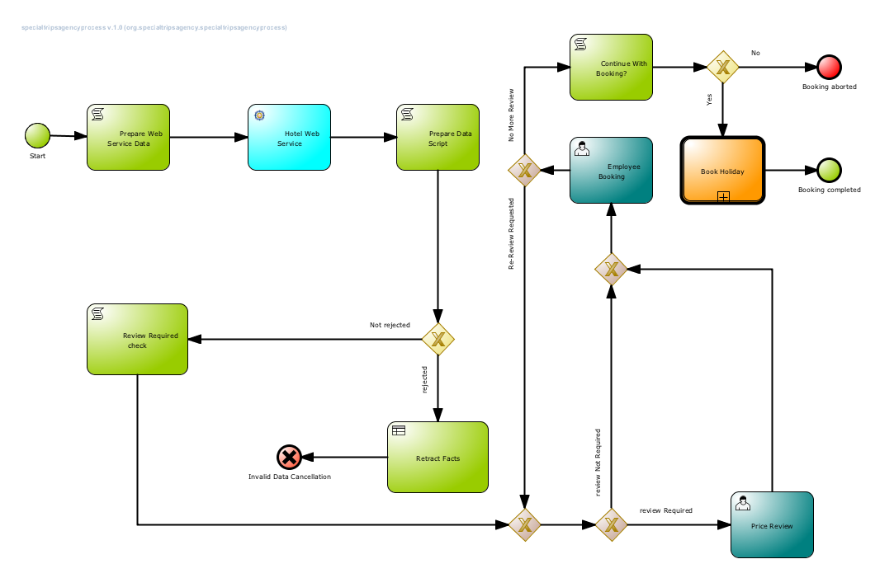

= JBoss BPMSuite 6.x Workshop Labs

== Lab 8: Implement WebService call

In this lab we will implement the WebService call from the JBoss BPMSuite process to the Flight WebService.

=== Objectives
 
* Learn how to use the JBoss BPMSuite WebServiceWorkItemHandler
* Learn how to map process data to WorkItemHandlers
* Learn how to call a WebService from a JBoss BPMSuite process

== Introduction

In this lab we will explore the initial process provided in the workshop. In further labs we will expend this process, with the goal to finally implement the full https://github.com/jbossdemocentral/bpms-travel-agency-demo[Travel Agency Demo] process show below:

== Process
The Travel Agency process consists of a main process (_specialtripsagencyprocess_) and 2 (reusable) sub-processes (_calculatepriceprocess_ and _compensateService_). The use-case of the process is booking a holiday, which includes booking a flight and hotel, and doing a payment. The high-level tasks are:

* Start the process by providing the input data (e.g. name, e-mail address, origin, destination, travel-dates, etc.)
* Retrieve flight and hotel information
* Validate the data
* Calculate the price.
* Review the price of required.
* Provide payment details.
* Book flight and hotel

For this workshop we've remove some steps from the final process. The goal of the exercises is to add the required steps to (re-)create the full process.

Open JBoss BPMSuite Business Central at http://localhost:8080/business-central (u: bpmsAdmin, p: bpmsuite1!) and open the _specialtripsagencyprocess_. The inital process looks like this

