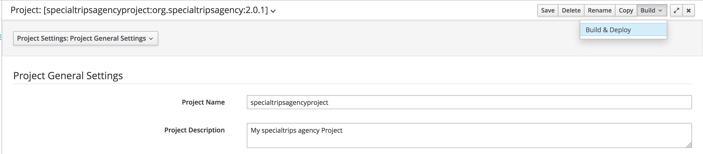
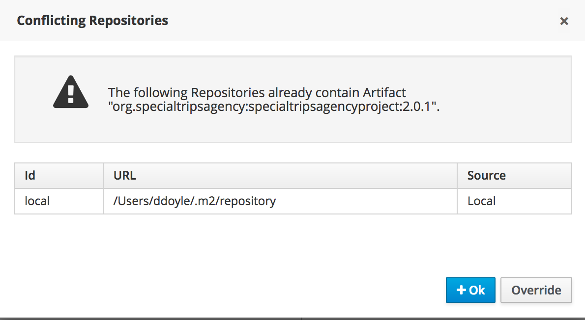
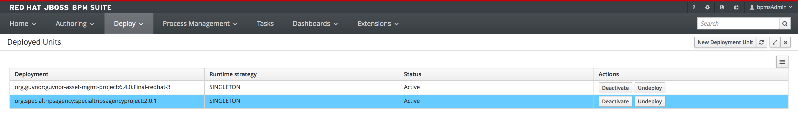
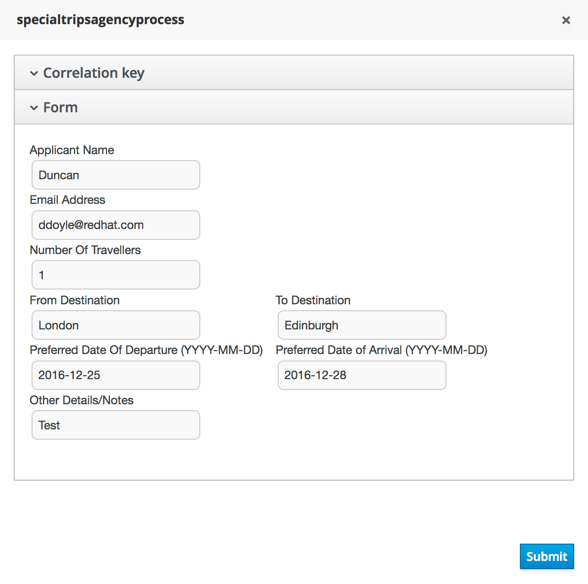
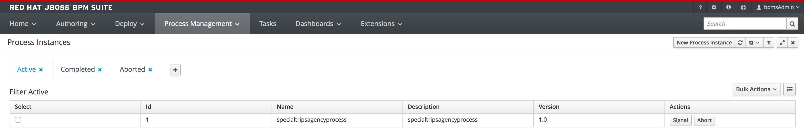
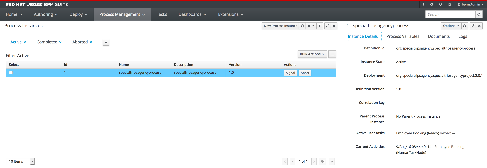
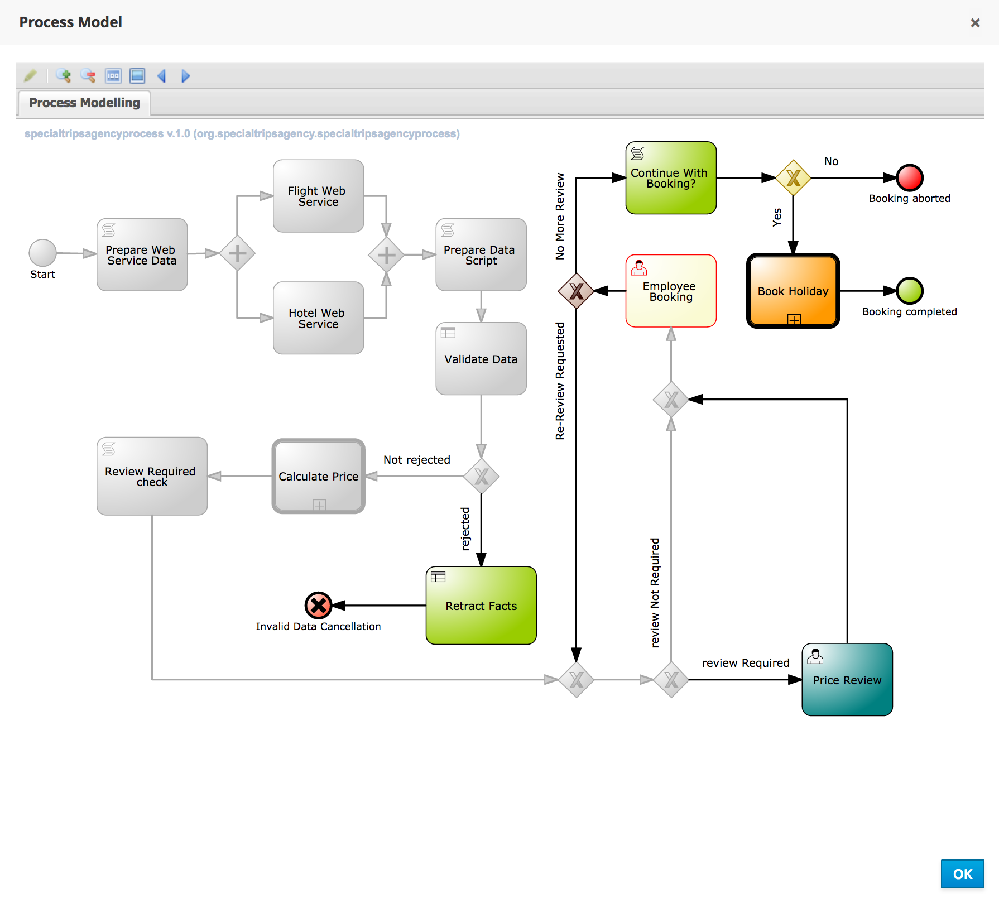
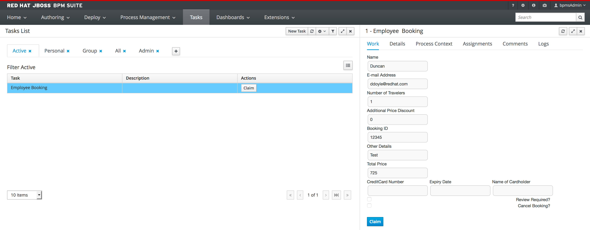
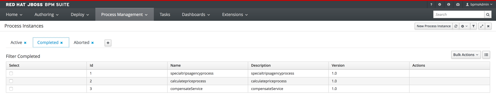
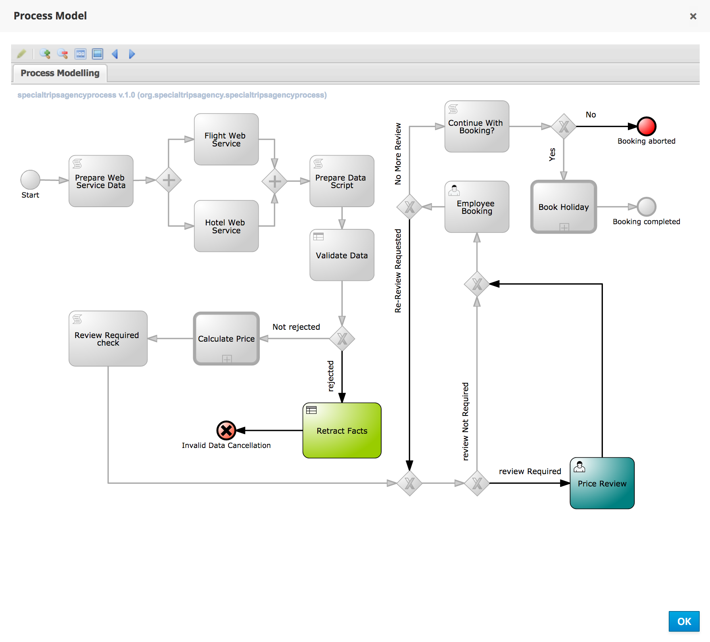

= JBoss BPMSuite 6.x Workshop Labs

== Lab 12: Deploy and Test the process

In this lab we will deploy and test our process.

=== Objectives
 
* Learn how to _Build and Deploy_ the project.
* Learn how to start the process
* Learn how to inspect process execution
* Learn how claim, start and complete a human task.

== Introduction

In this lab we will test the end-to-end process that we've completed in this workshop. Once we've deployed the process, we will start a process, interact with the Human Task form we've created in the previous lab and inspect the process execution.

image:images/org.specialtripsagency.specialtripsagencyprocess.png["Special Trips Agency Process."]

== Build and Deploy the process
[start=1]
. Click on the _Open Project Editor_ button. In the upper right corner of the window there is a _Build_ button. Click on this button and click on _Build and Deploy_.

[start=2]
. The build will start. It will create a _KJAR_ artifact of our project and deploy it in our Maven repository. If we already have such an artifact in our repository, the following pop-up will be shown. Click on _Override_.

[start=3]
. If the build is succesfull, the _KJAR_ will have been deployed on the platform and our process will be available on the runimte. Click on _Deploy -> Process Deployments_ to see the "Deployed Units". If our build was succesfull, the _org.specialtripsagency:specialtripsagencyproject:2.0.1_ should be one of the "Deployed Units".

[start=4]
. Click on _Process Management -> Process Definitions_. This will show the "Process Definitions" view in which all our deployed process definitions should be visible. Note that apart from our main process, we can also see our subprocesses.

image:images/lab12-process-definitions.png["Process Definitions.", 768]

[start=5]
. Click on the _start_ button of the _specialtripsagencyprocess_. This will open the start process form for our process (this form was pre-defined in our workshop. The name of the form in our project is _org.specialtripsagency.specialtripsagencyprocess-taskform_. Use the following values to start the process:

[start=6]
. After the process has started, we can inspect the running processes in the "Process Instances" view, which can be opened via _Process Management -> Process Instances_. We can see one running process instance:

[start=7]
. We can inspect the details of the running process instance, including its current state, the values of its process variables, etc. by clicking on the process instance.

[start=8]
. We can also inspect the process image and the current state of the process. Click on the process instance you want to inspect and click on _Options -> Process Model_. We can see that the process instance is in a wait-state on the _Employee Booking_ human task node.

[start=9]
. We can view the open human tasks that are assigned to, or can be claimed by, the current user by opening the "Tasks List". It can be opened by clicking on "Tasks". We can see that there is one task in our task-list, which is our _Employee Booking_ task. By clicking on the task, we can inspect its details.

[start=10]
. To be able to work on the task, the task first needs to be claimed. This can be done by clicking on the _claim_ button. Once the task has been claimed, we can _save_, _release_ or _complete_ it. The form displayed is the form we've created in our previous lab. This form allows us to either complete the booking (by entering creditcard details), mark the booking for review, or cancel the booking. We will complete the booking by entering the following details in the form:

* CreditCard Number: 987654321
* Expiry Date: 08/18
* Name of Cardholder: DG Doyle

Click on _Complete_ to submit the form and complete the human task. This will signal and continue the process.

[start=11]
. Open the _Process Instances_ view. Note that there are no running process instances anymore. Click on _Completed_ to show the list of completed process instances. There are 3 completed process instances, our main process and our 2 subprocesses:

[start=12]
. We can inspect the path the process has taken by again opening the process model image. Click on our main process, the _specialtripsagencyprocess_, and click on _Options -> Process Model_

== Conclusion
In this lab we've seen how we can _Build and Deploy_ our project, which installs the project on the platform's runtime and makes it available for use. We've seen how we can start a process, how we can inspect its runtime state and how we can interact with the Human Task server.
