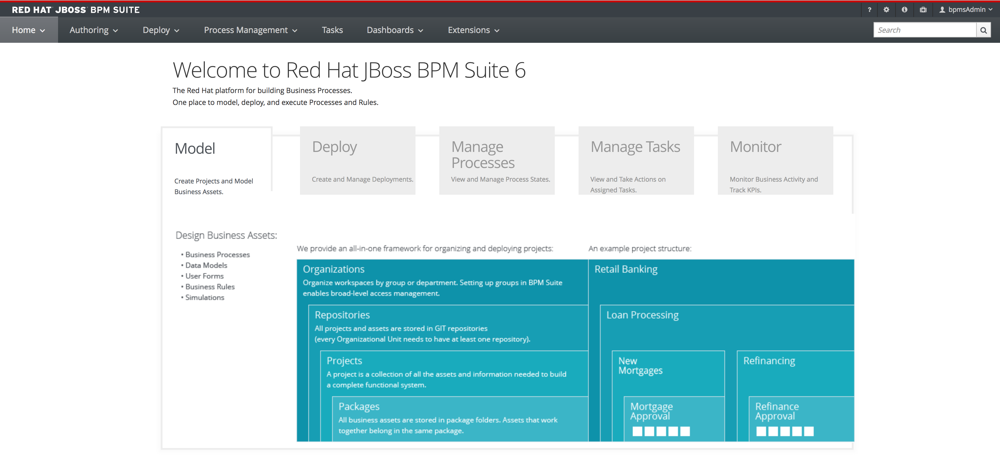
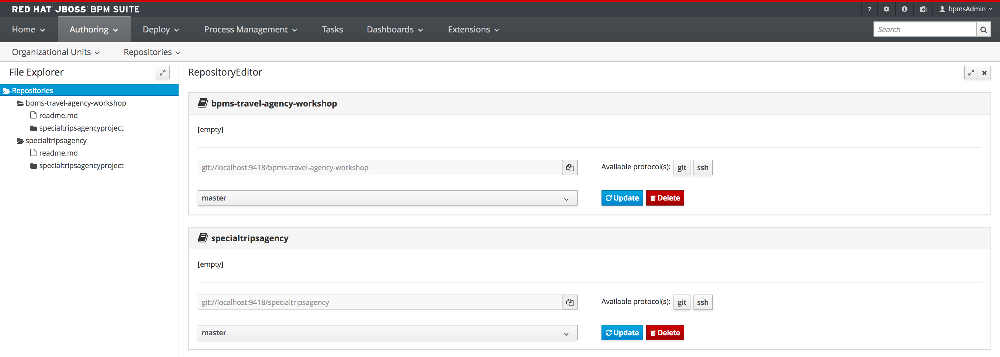

= JBoss BPMSuite 6.x Workshop Labs

== Lab 1: Exploring Business Central

You have been provided with a pre-defined and pre-installed runtime for these labs. The environment contains the following runtimes, tools and utilities:

* JDK 1.8.0: The Java Development Kit, version 8
* JBoss EAP 6.4.21.GA: The JBoss Enterprise Application Platform runtime on which JBoss BPMSuite runs (note that BPMSuite supports other containers as well).
* JBoss BPM Suite 6.4.11.GA 

=== Objectives
 
* Explore the provided lab runtime.
* Learn how to start and access the Business Central environment of JBoss BPMSuite.
* Explore the various Authoring views: Administration, Artifact Repository and Project Authoring.

== Introduction

In this first lab we will explore the JBoss BPMSuite Business-Central environment. Business Central serves as both the design-time (authoring) and runtime environment of the BPMSuite platform. In this lab we will learn how to start the platform, how to access the Business Central web-platform and the various components that Business Central is comprised of.

== Starting and accessing the platform
[start=1]
. Your VM comes with JBoss BPMSuite pre-installed (to learn how to install JBoss BPMSuite, please consult the "Getting Started" guide on http://developers.redhat.com/products/bpmsuite/get-started/[developers.redhat.com]. 

- The platform should be already started; Otherwise, to start the platform, open a terminal, navigate to _/opt/jboss-as/jboss-eap-6.4/bin_ and execute the _standalone.sh_ script. This will start the JBoss BPMSuite platform deployed on JBoss Enterprise Application Platform. The platform has started succesfully when the following message is displayed on the console:

`08:32:45,714 INFO  [org.jboss.as] (Controller Boot Thread) JBAS015874: JBoss EAP 6.4.11.GA (AS 7.5.7.Final-redhat-3) started in 44379ms - Started 1293 of 1330 services (93 services are lazy, passive or on-demand)`

[start=2]
. Open the Firefox browser and navigate to http://localhost:8080/business-central . Log-in to the platform with the following credentials

* Username: `bpmsAdmin`
* Password: `bpmsuite1!`

After a succesful login, the main Business Central screen will open.

[start=3]
. Business Central contains both a design-time, runtime and monitoring environment. Business Central defines the following perspectives:

* **Authoring**: gives access to the _Project_, _Artifact Repository_ and _Administration_ views. These views allow to manage repositories and projects, author components like process definitions and rules, etc.
* **Deploy**: this perspective focusess on deployment of (compiled) artifacts (KJAR), the configuration of the Decision Servers (lightweight runtime) and runtime Jobs.
* **Process Management**: provides the interfaces for the the _Process Deployments_ and _Process Instances_. These views allow to manage processes at runtime.
* **Tasks**: this perspective provides the Human Task Lists.
* **Dashboards**: Process and Business Activity Monitoring dashboards.
* **Extensions**: allows to extend the Business Central UI

[start=4]
. Inspect some of the views and perspectives. Open, for example, the _Authoring -> Administration_ view, which shows the source repositories (Git) configured on the platform.

== Conclusion
In this lab we've started the JBoss BPMSuite platform and briefly explored some of the functionalities and features it provides.

In the next lab we'll take a closer look at the _Project Authoring_ view.

