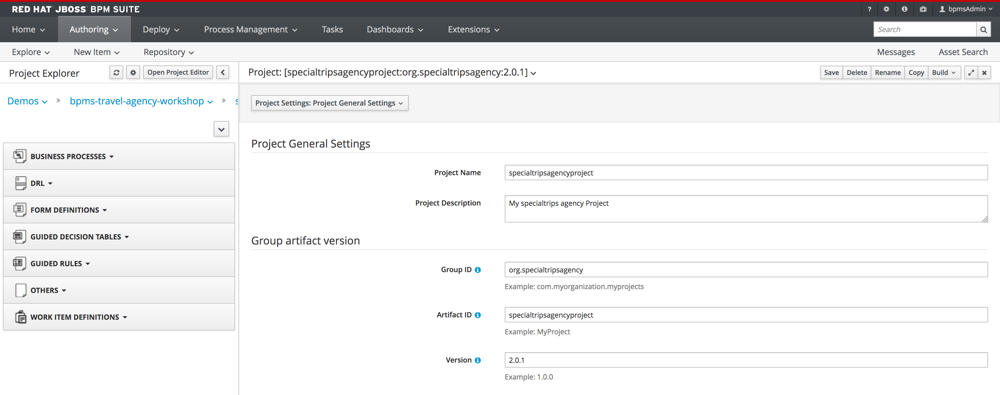
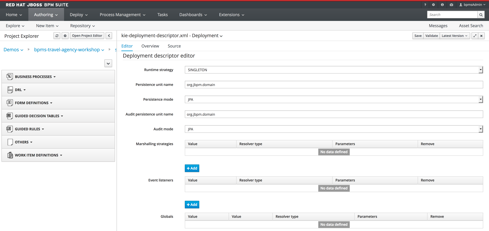
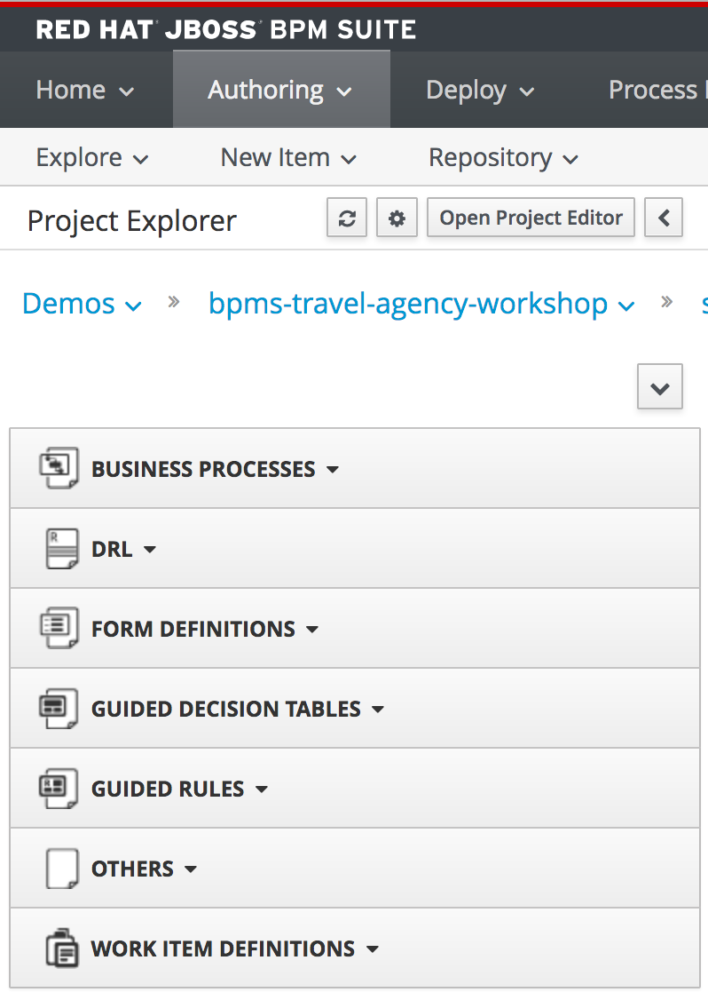
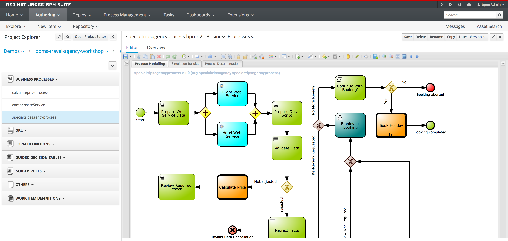

= JBoss BPMSuite 6.x Workshop Labs

== Lab 2: Exploring the project

In this lab we will explore the provided project for this workshop.

=== Objectives
 
* Explore the Business Central Project Authoring view
* Explore the provided project

== Introduction

The objective of the workshop is to complete the Travel Agency Demo, one of our standard demo's provided on https://github.com/jbossdemocentral/bpms-travel-agency-demo[JBoss Demo Central].

For this workshop we've adapted the standard project, by removing nodes from the process, removing rule definitions etc. The goal of this workshop is to complete the project and build a working BPMSuite solution.

In this lab we will first explore the project, the process, the rules, etc.

== Exploring the project

[start=1]
. Login to Business Central and open the _Authoring -> Project Authoring_ perspective.

[start=2]
. If the "Project Editor is not open yet, click on the _Open Project Editor_ button. The Project Editor allows to configure the name and version of the project, its dependencies, the runtime configuration (like runtime-strategy, marshallers, database configuration, ect.).

[start=3]
. The left-hand-side of the screen shows the various artefacts that have been defined in our project, like the BPMN2 Business Processes, DRL (rules), Form Definitions, etc. Our workshop project already has quite some artefacts pre-defined.

[start=4]
. Every artefact has a different editor. Expand the _Business Processes_ category and click on the _specialtripsagencyprocess_. This will open the process in the BPMN2 editor.

[start=4]
. Every artefact has a different editor. Expand the _Business Processes_ category and click on the _specialtripsagencyprocess_. This will open the process in the BPMN2 editor.

[start=5]
. Open the _AdditionalTravelersDiscount_ file in the _Guided Decision Tables_ category to open the decision table editor.

image:images/lab2-decision-table-editor.png["Decision Table Editor", 512]

[start=6]
. Open some additional files to explore the various files and artefacts defined in the project.

== Conclusion

We've briefly explored the project that will serve as the base for our labs. We've seen the project editor, which allows us to define and configure various design-time and runtime properties of our project. We've seen various files and their respective editors, and should have gotten a basic overview of the structure of our project.

In the next lab we will use the Data Modeler component to create (part of) the project's data-model. 

