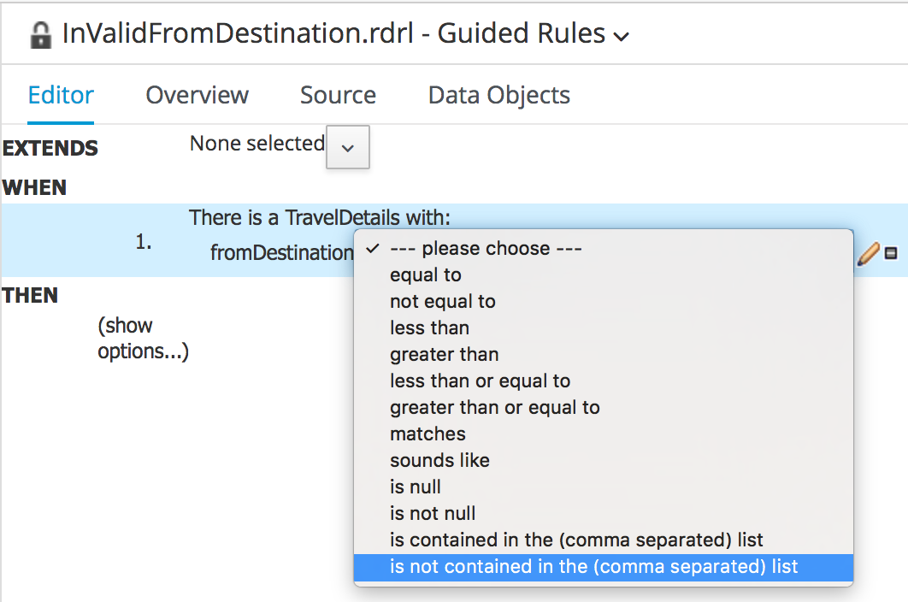
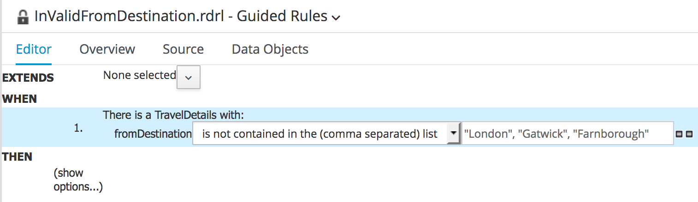

= JBoss BPMSuite 6.x Workshop Labs

== Lab 4: Guided Rule Editor

In this lab we will create a rule, using the Guided Rule Editor, that validates the input data of the process

=== Objectives

* Learn how to use the Guided Rule Editor
* Create a new rule that validates the "from" destination specified in the process input data.

== Use Case
JBoss BPMSuite business rules allow to separate the process and process implementation from the business rules underlying the process. These business rules can provide all sorts of functionality:

* **Data validation**: determine if the process input data is valid.
* **Calculation**: calculate the price of the offer. This can for example include discounts, shipping costs, etc.
* **Compliancy**: determine whether the data is compliant with the law, rules and regulations. E.g. is a passport still valid for 6 months on the day of departure.

JBoss BPMSuite comes with integrated JBoss BRMS functionality. BRMS allows to write rules in all sorts of formats:

* **Drools Rule Language (DRL)**
* **Guided Rules**
* **Decision Tables**

In this lab we will implement a Guided Rule that determines whether the _From Destination_ provided in the input data is valid. In this example, the _From Destination_ is said to be valid if it has one of the following values:

* **João Pessoa**
* **Recife**
* **Salvador**

If the destination is not in this list, we add a _fact_ called _Rejection_ to the KieSession. This allows us to later act on the presence of this fact to determine the route to take in the process. E.g. if there is a _Rejection_ fact present in the process session, we can decide that we want to route to a HumanTask to fix the input data.

== Data/Fact model

To implement the rule, we have to use the following Fact types:

* _TravelDetails_: this fact encapsulates the _fromDestination_ we require in our rule.
* _Rejection_: the fact we want to insert into the session if the _fromDestination_ is not valid.

== Create the Guided Rule

[start=1]
. Create a new Guided Rule called _InvalidFromDestination_ by clicking on "New Item -> Guided Rule"

image:images/lab4-new-guided-rule.png["New Guided Rule",384]

Complete the wizard.

image:images/lab4-new-guided-rule-wizard.png["New Guided Rule Wizard", 512]

[start=2]
. In the Guided Rules Editor, click on the "Data Objects" tab. This will allow us to import the required "Data Objects" (or "Facts") to be used in our rule.

image:images/lab4-guided-rule-data-objects.png["Guided Rule Data Objects", 1024]

[start=3]
. Import the _TravelDetails_ and _Rejection_ Data Objects so they can be referenced in the rules. This can be done by clicking on the "New Item" button in the editor.

image:images/lab4-guided-rule-new-data-object.png["Guided Rule New Data Object", 768]

[start=4]
. Click on the "Editor" tab to open the main view of the Guided Rule Editor. In this view we will add the conditions (constraints) and consequences of our rule. First, click on the "+" sign next to the _When_ label in the editor. This will open a wizard in which you can add a _condition_ to the rule. Select _TravelDetails_ and click on "OK"

image:images/lab4-guided-rule-add-condition.png["Guided Rule Add Condition", 512]

[start=5]
. We need to add a _constraint_ to the _condition_ we have just created. I.e. the specification states that the value of the _fromDestination_ field of the _TravelDetails_ fact should have either the value _João Pessoa_, _Recife_ or _Salvador_. To add a _constraint_ the the condition, click on the _condition_ in the editor. In our case we need to click on "There is TravelDetails". This will open the "Modify constraints for TravelDetails" wizard. In this wizard, select "fromDestination" in the "Add a restriction on a field" drop-down list.

image:images/lab4-guided-rule-modify-constraint.png["Guided Rule Modify Constraint", 512]

[start=6]
. Next we need to select the operator we want to apply to the constraint. In this case we want to check whether the value of the field is *not* one of the values defined in list of values, in which case we want to reject the booking. Hence, we select the "is not contained in the (comma separated) list" operator.

[start=7]
. To add the list of values, click on the pencil sign next to the operator. This will open an editor in which we need to click on "Literal Value". A text-field is created on the right-hand-side of the operator. In this field, add the following comma separated list of values: _João Pessoa,Recife,Salvador_

[start=8]
. Now that we've defined the Left-Hand-Side (LHS) of the rule (i.e. the constraints), we need to add the consequence, or Right-Hand-Side (RHS). The RHS defines the action to be executed when the rule matches and fires. Click on the "+" sign next to the _Then_ label in the editor. This will open a wizard in which you can add a new _action_ to the rule. Select _Insert fact Rejection_ and click "OK".

image:images/lab4-guided-rule-add-action.png["Guided Rule Add Action", 512]

[start=9]
. Next, we want to set a message on the rejection to state why the data is rejected. Click on the "Insert Rejection" text in the editor to open the "Add a field" editor. In this editor, select the _reason_ field.

image:images/lab4-guided-rule-action-add-field.png["Guided Rule Action Add Field", 512]

[start=10]
. To add the actual value of the message, click on the "pencil" icon next to the _reason_ field. In the wizard that opens, click on _Literal value_. This will create a value field next to the _reason_ field. Add the following text to the field: _"Sorry, we do not provide services from this destination."_

[start=11]
. Finally, we need to configure the so called _ruleflow-group_ of the rule. The _ruleflow-group_ defines the group in which the rule is defined. This controls when the rule can be fired within the execution of the process. The _Rule Node_ in a BPMSuite BPMN2 process definition has a _ruleflow-group_ property. When the process enters a _Rule Node_, the _ruleflow-group_ configured on that node is activated and the rules defined in that group can be fired. In essence, it defines the order of rule execution within a BPMSuite process. To configure the _ruleflow-group_, click _show options_ in the Guided Rule Editor. Click on the "+" sign on the right side of the editor to add an additional option. In the wizard select the attribute "ruleflow-group". In the text field next to the _ruleflow-group_ attribute, enter the value "rejection".

image:images/lab4-guided-rule-ruleflow-group.png["Guided Rule Ruleflow-Group", 512]

image:images/lab4-guided-rule-ruleflow-group-value.png["Guided Rule Ruleflow-Group Value", 512]

[start=12]
. Click on the _Save_ button in the upper right corner of the editor to save the rule.
