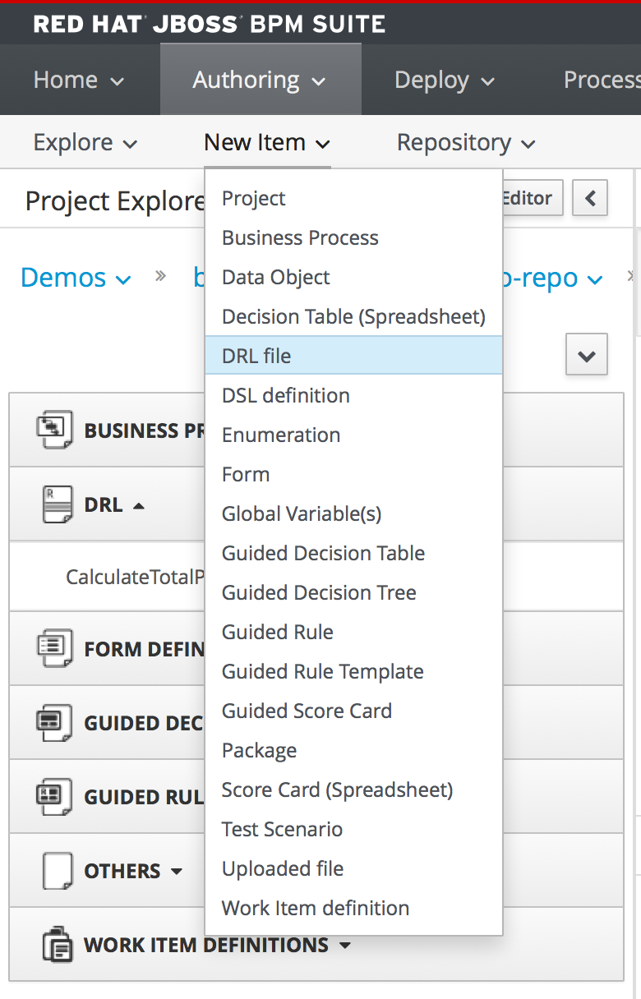
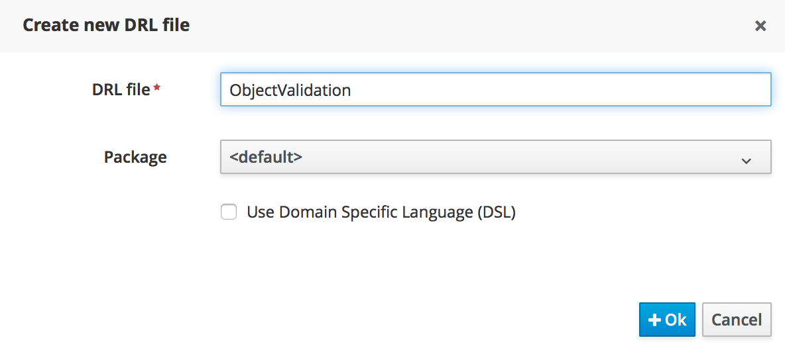
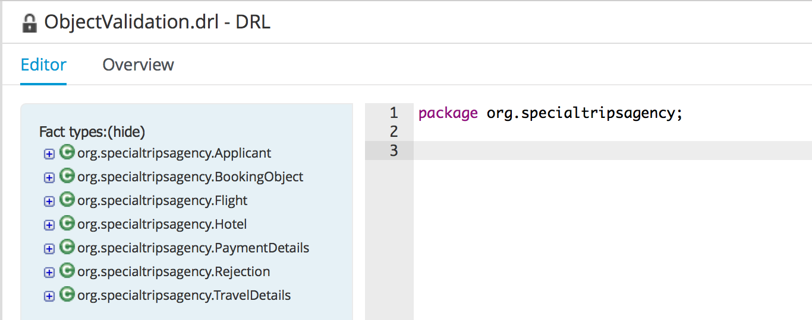
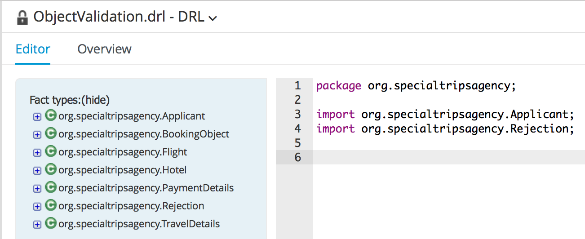
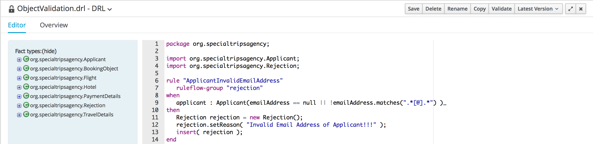

= JBoss BPMSuite 6.x Workshop Labs

== Lab 5: Technical Rules

In this lab we will add an additional rule to the "rejection" _ruleflow-group_. The rule will be written in the Drools Rule Language (DRL) and will check whether the provided e-mail address is valid.

=== Objectives
 
* Learn how to use the Drools Rule Language.
* Implement a rule that checks whether the provided e-mail address is valid.

== Use Case
In the previous lab we've defined a Guided Rule which rejects the input data if the _From Destination_ value is not a value in our pre-defined list of definitions. This rule is part of the _rejection_ ruleflow-group. In this lab we will add an additional rule to that ruleflow-group which checks whether the entered e-mail address is valid. We will write this rule in the Drools Rule Language (or DRL).

== Data/Fact model

To implement the rule, we have to use the following Fact types:

* _Applicant_: this fact encapsulates the _emailAddress_ we want to validate
* _Rejection_: the fact we want to insert into the session if the _emailAddress_ is not valid.

== Create the DRL Rule

[start=1]
. Create a new DRL file called _ObjectValidation_ by clicking on "New Item -> DRL file"

Complete the wizard

[start=2]
. We first need to define the package name of the rule. Add the following line in the editor: _package org.specialtripsagency;_

[start=3]
. Add the required imports to the DRL file. In this rule we require the _Applicant_ and _Rejection_ types, so we will add the following 2 lines to the DRL file:

_import org.specialtripsagency.Applicant;_
_import org.specialtripsagency.Rejection;_

[start=4]
. We can now start creating the actual rule. We will first define the skeleton of the rule. A rule consists of a name, attributes, a left-hand-side and a right-hand-side. Add the following skeleton to the DRL file
[source, drl]
----
rule "ApplicantInvalidEmailAddress"
when

then

end
----

[start=5]
. The first thing we want to add to the rule is LHS, the condition. We add the following line to the _when_ part of the rule:
[source, drl]
----
applicant : Applicant(emailAddress == null || !emailAddress.matches(".*[@].*") )_
----
This line states that we match on an _Applicant_ fact that either has no _emailAddress_ or that has an _emailAddress_ that does not match the given regulare expression.

[start=6]
. Next we add the RHS, or consequence, of the rule. If the rule matches, we want to insert a new _Rejection_ fact into the session with a proper message set on it's _reason_ field. We do this by adding the following line in the _then_ part of the rule.
[source, drl]
----
Rejection rejection = new Rejection();
rejection.setReason( "Invalid Email Address of Applicant!!!" );
insert( rejection );
----
We can define any sort of Java logic in the RHS of our rule. In this case we create a new instance of the _Rejection_ class, set a _reason_ on the instance and insert the fact to the session using the Drools _insert_ keyword.

[start=7]
. Finally we need to add the _ruleflow-group_ attribute to the rule with the value "rejection". The final rule should look like this:
[source,drl]
----
rule "ApplicantInvalidEmailAddress"
   ruleflow-group "rejection"
when
   applicant : Applicant(emailAddress == null || !emailAddress.matches(".*[@].*") )_
then
   Rejection rejection = new Rejection();
   rejection.setReason( "Invalid Email Address of Applicant!!!" );
   insert( rejection );
end
----

[start=8]
. Click on the _Save_ button in the upper right corner of the editor to save the rule.
