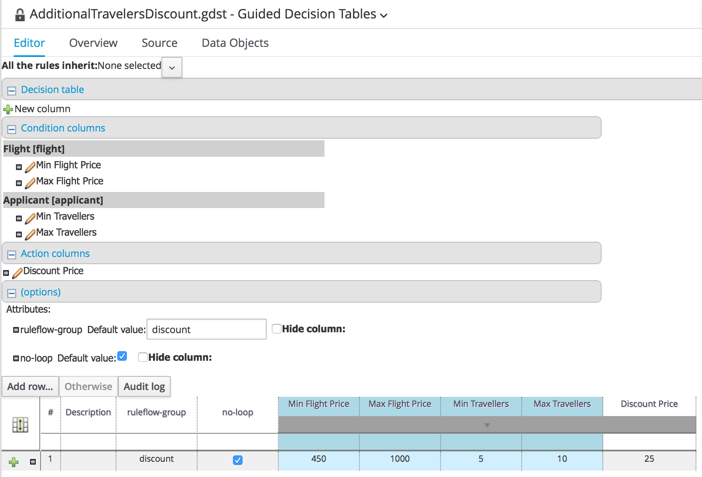
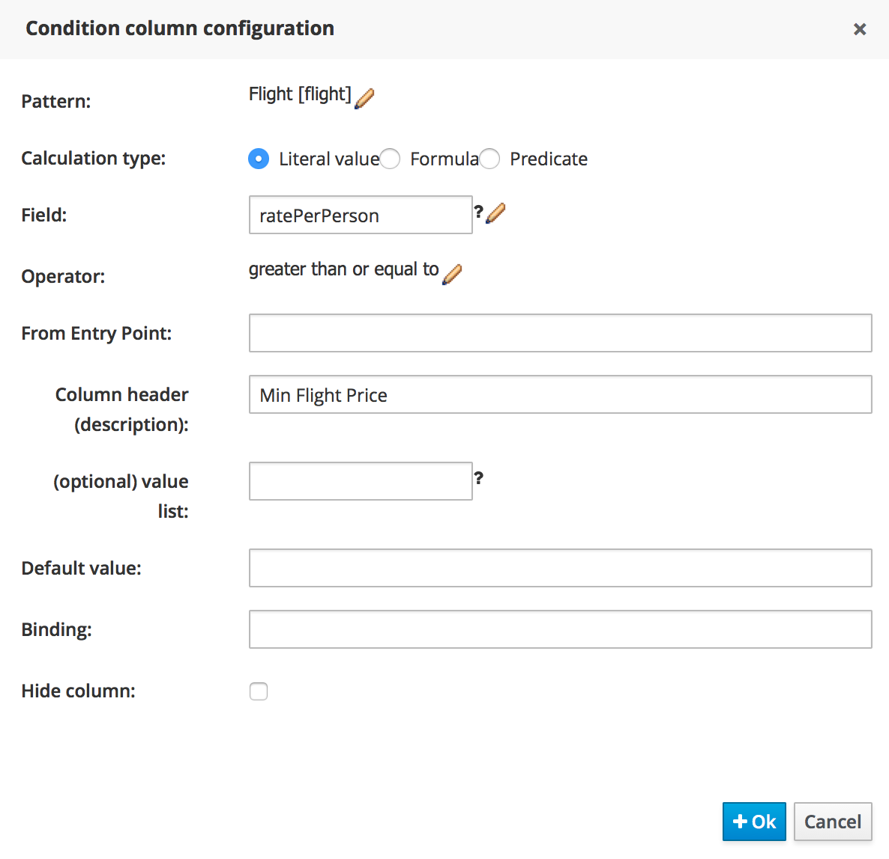
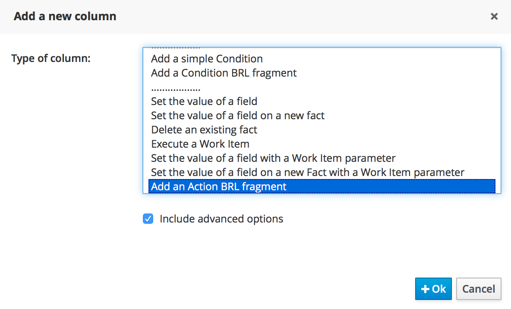
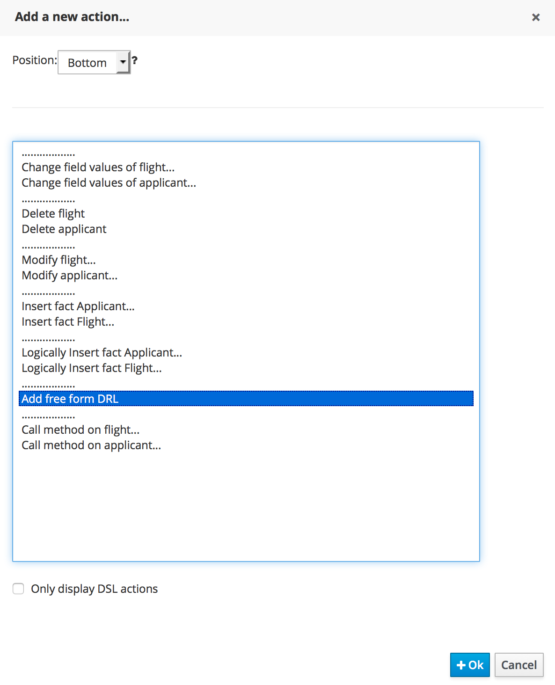
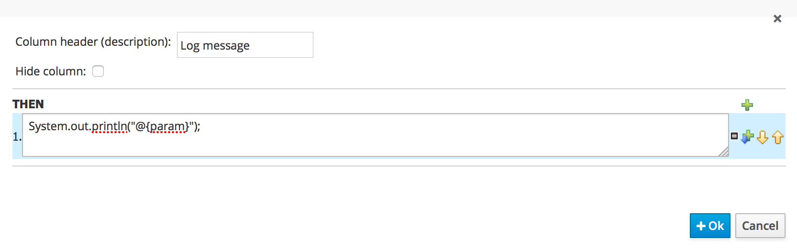
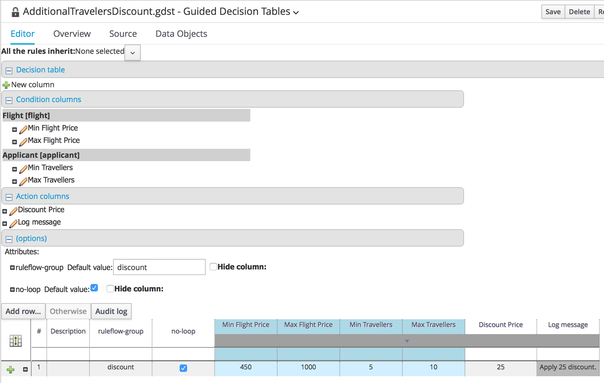
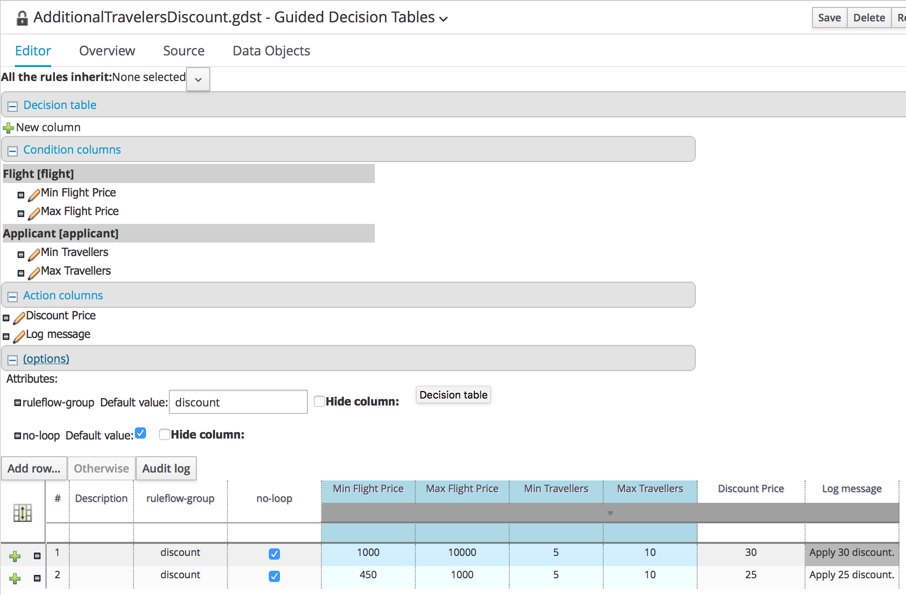

= JBoss BPMSuite 6.x Workshop Labs

== Lab 6: Decision Tables

In this lab we will implement a discount calculation rule using a decision table.

=== Objectives
 
* Learn about Decision Tables
* Learn how to use the BPMSuite Decision Table editor
* Implement an additional discount rule.

== Use Case
So far we've seen 2 ways to implement a business rule in BPMSuite project. In this lab we will look at a third way: decision tables.

Decision tables are probably the most business-friendly way to define rules. The decision table layout provides a pre-defined rule template where each column defines either a rule attribute (e.g. "salience", "ruleflow-group", etc.), a condition (LHS) or a consequence (RHS). Each row in a decision table gets translated into an individual rule.

At compile time, decision tables are compiled into DRL.

In JBoss BPMSuite we have basically 3 types of decision tables:

* Decision Tables defined in Excel
* Limited entry decision tables: the columns in these decision tables define both the constraints, operators and values. The only thing that a user can define in a cell is whether a column applies to a row (rule) or not (selected or not selected).
* Extended entry decision tables: the columns in these decision tables define the constraints and operators. The cells define the values.

== Decision Table

In this lab we will re-use an existing decision table, the _AdditionalTravelersDiscount_ decision table, which is defined in the ruleflow-group _discount_ and used in the _calculatepriceprocess_ (which is a sub-process used in our main _specialtripsagencyprocess_).

The decision table has:

* 2 Attribute columns: the _no-loop_ column (which defines that the consequence of a rule cannot reactivate itself) and the _ruleflow-group_ attribute (which is by default set to "discount")
* 3 Condition columns: one condition on the _Flight_ fact, and two conditions on the _Applicant_ fact.
* 1 Action column: an action column which sets the _priceDiscount_ field on the _Flight_ fact.

New attribue,condition and action columns can be defined by clicking on the "+ New column" button at the top of the editor.

== Inspect the condition columns
To get a bit of a feel of the decision table editor, we will inspect one or more of the condition (LHS) columns.

[start=1]
. Click on the "pencil" icon next to "Min Flight Price" label under the "Flight [flight]" fact. This will open the "Condition column configuration" editor.

[start=2]
. Inspect the elements of the editor:

* _Pattern_: defines the fact (object) type which should be matched.
* _Calculation Type_: defines the type of constraint
** _Literal_ : The value in the cell will be compared with the field using the operator.
** _Formula_: The expression in the cell will be evaluated and then compared with the field.
** _ Predicate_ : No field is needed, the expression will be evaluated to true or false.
* _Field_: the field with which the value in the cell needs to be compared.
* _Operator_: the operator to be used for the comparison.
* _From Entry Point_: the _Entry Point_ from which the fact will be evaluated. Entry points can be used to define multiple streams of facts/events into the rules/process session.
* _Column Header_: the header to be displayed in the header of the decision table's column.
* _(optional) value list_:
* _Default Value_:
* _Binding_:
* _Hide column_: will hide the column from the decision table editor if selected.

[start=3]
. Close the editor by clicking on the "Cancel" button.

== Add a new action column.
We will now add an action column to the decision table. The action column will do nothing more than adding a log message, but should give an idea on how to add condition and action columns to an existing decision table.

[start=1]
. Click on the "+ New column" button in the decision table editor.

[start=2]
. Select "Include advanced options" and select "Add an Action BRL fragment".

[start=3]
. In the "Column header (description)" field enter "Log message". Click on the "+" sign next to the "Then" label and select "Add free form DRL".

[start=4]
. Add the following line to the "free form DRL" field (note the "template variable" "@{param}":
[source,drl]
----
System.out.println("@{param}");
----

[start=5]
. In the new cell, add the log message we want to have printed when the RHS of the rule fires. Add the text "Applying 25 discount.".

[start=6]
. The descision table will look like this. Click on the "Save" button in the upper right corner to save the rule to the repository.

== Add a new rule
A new rule is simply added by adding an addionanl row to the decision table. In this example we will add an additional rule that sets a _Discount Price_ of 30 when the price of the flight is over a 1000.

[start=1]
. Click on the "+" sign next to the row of our first rule in the decision table. This will add an additional row (and thus rule) to our decision table. Add the values as show in the image below to the cells.

[start=2]
 . Click on the "Save" button in the upper right corner to save the rule to the repository.

