= JBoss BPMSuite 6.x Workshop Labs

== Lab 7: Exploring the Process

In this lab we will explore the initial process that we will use in the remainder of this workshop.

=== Objectives
 
* Learn how to use the BPMN2 Process Editor
* Learn the constructs of the initial process.

== Introduction

In this lab we will explore the initial process provided in the workshop. In further labs we will expend this process, with the goal to finally implement the full https://github.com/jbossdemocentral/bpms-travel-agency-demo[Travel Agency Demo] process show below:

image:images/org.specialtripsagency.specialtripsagencyprocess.png["Travel Agency Demo process", 1024]

== Process
The Travel Agency process consists of a main process (_specialtripsagencyprocess_) and 2 (reusable) sub-processes (_calculatepriceprocess_ and _compensateService_). The use-case of the process is booking a holiday, which includes booking a flight and hotel, and doing a payment. The high-level tasks are:

* Start the process by providing the input data (e.g. name, e-mail address, origin, destination, travel-dates, etc.)
* Retrieve flight and hotel information
* Validate the data
* Calculate the price.
* Review the price of required.
* Provide payment details.
* Book flight and hotel

For this workshop we've remove some steps from the final process. The goal of the exercises is to add the required steps to (re-)create the full process.

Open JBoss BPMSuite Business Central at http://localhost:8080/business-central (u: bpmsAdmin, p: bpmsuite1!) and open the _specialtripsagencyprocess_. The inital process looks like this

image:images/lab7-initial-process.png["Initial Travel Agency Process"]

== Proces Variables

To work with data in a process, a process requires process variables. Process variables are stored in the process context (or _kcontext_) and are accessible anywhere in the process. By default, the variales are stores with the process instance in BLOB format in the BPMSuite database. To serialize/marshall the process variables, JBoss BPMSuite relies on Java Serialization. This means that all process variables need to be of a data type that implements the `Serializable` interface.

As JBoss BPMSuite is a very flexible platform, it also allows to store process variables at a different location than the BLOB format of the process instance. This can be accomplished by implementing a custom _Marshalling Strategy_ for the process variables. This _Marshalling Strategy_ can then be configurd on the https://access.redhat.com/documentation/en-US/Red_Hat_JBoss_BPM_Suite/6.3/html/Administration_And_Configuration_Guide/sect-Deployment_Descriptors.html[Deployment Descriptor] of the deployment unit (KJAR).

Process variables are defined on the process definition.

[start=1]
. Open the `specialtripsagencyprocess` in the process designer in JBoss BPMSuite.
. Click on an empty space on the canvas. This selects the process properties.
. Open the properties panel on the right-hand-side of the editor by clicking on the double arrow icon on the top right of the editor.

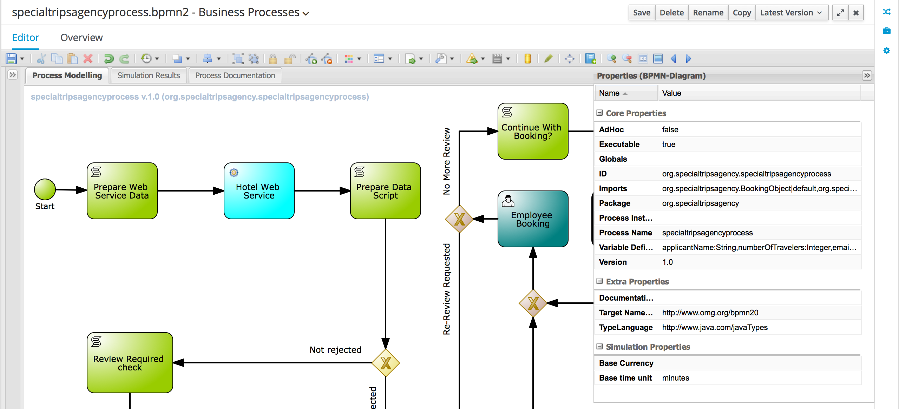

[start=4]
. In the properties editor panel, click on the "Variable Definitions" field. To open the editor, click on the down facing arrow icon in the "Variable Definitions" field.

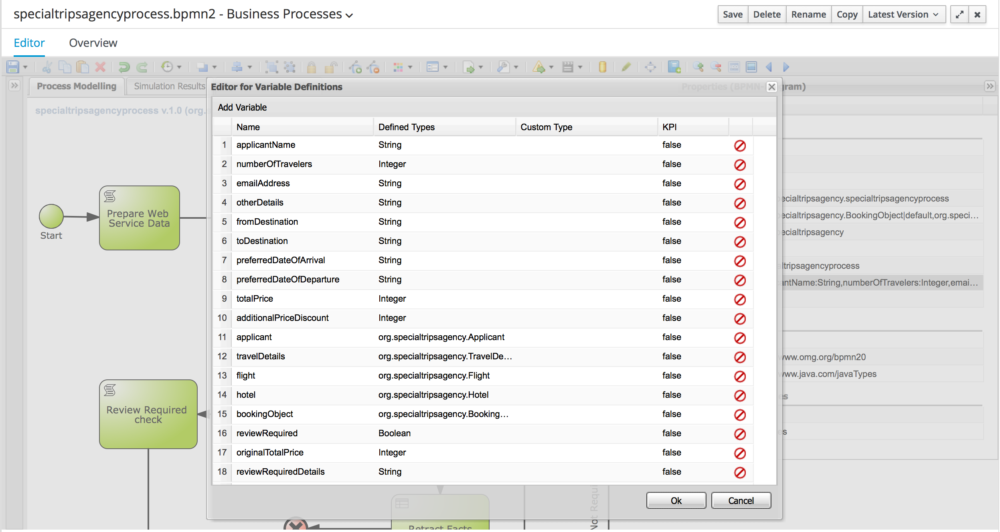

[start=5]
. The editor allows us to add, edit and delete process variables. In the editor we can see that we can define both process variables of primitive types, as well as process variables of complex types. The only requirement is that the complex either needs to implement the `Serializable` interface, or that a custom _Marshalling Strategy has been defined and configured for the complex type.

== Process Nodes

The _specialtripsagencyprocess_ uses most of the basic nodes available in JBoss BPMSuite. 

=== Start Event

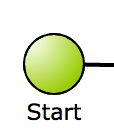

The _Start Event_ defines the start of the process. JBoss BPMSuite supports multiple BPMN2 start event types:

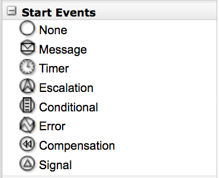

The _specialtripsagencyprocess_ uses a so called _none_ start event, which implies that the process is started by explicitly calling _start_ on the process. Other ways to start a process are via a message (_message start event_), singnal ("_signal start event_"), timer (_timer start event), etc.

=== Script Task Node

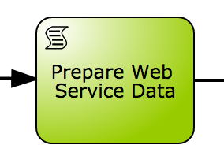

BPMN 2 defines multiple types of _Task Nodes_.

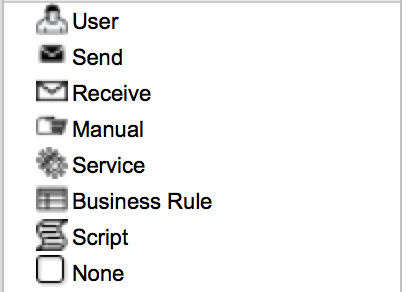

The _Script Task Node_ is a task node that executes a script. JBoss BPMSuite supports multiple scipt languages, including Java, JavaScript and MVEL. Scripps can be used to, for example, log messages, prepare process data (e.g. composition of a WebSevice request), set process variables, etc.

Note that it is common practice in BPMN2 business processes to have each node in the process represent a business action. Script task nodes usually do not represent business actions, states and/or events, but are usually have a more technical nature. Therefore, using script task nodes in process definitions sometimes is questionable from a  business process design perspective. JBoss BPMSuite however provides a second option to execute scripts. On each node in JBoss BPMSuite we can configure an _On Entry_ and _On Exit_ script action. These scripts are invisable in the process design, but can contain the same scripts as the script-task nodes. This allows to use scripts to, for example, initialize web-service request objects, without making the logic visible in the BPMN2 process design.

The _specialtripsagencyprocess_ uses a number of script task nodes, for example the _Prepare Web Service Data_ node, the first node in the process. This node prepares the webservice requests for the Flight and Hotel webservices (note that we will implement the Fligh WebService call later in these labs).

The script can be accessed by selecting the script task node in the process, and opening the properties window on the right-hand-side of the editor. The script is defined in the _Script_ property field. By clicking on the properties field, the script editor will open.

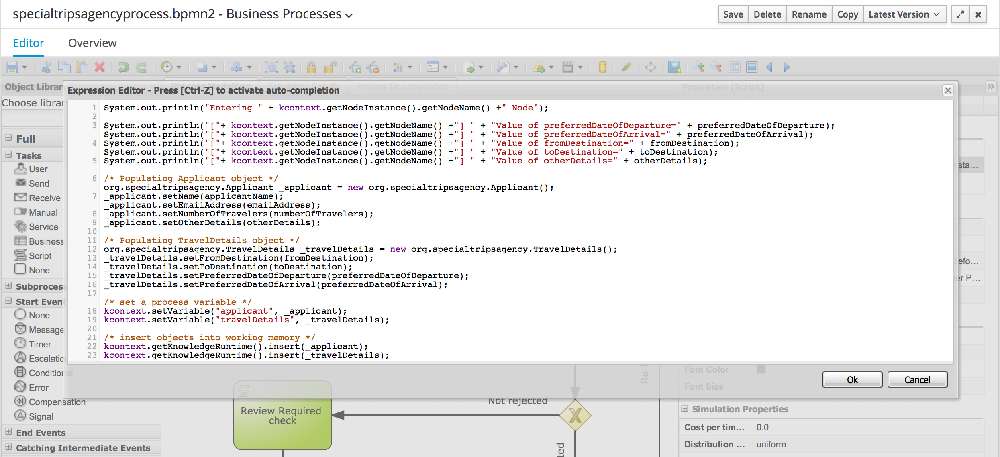

=== WebService Task Node

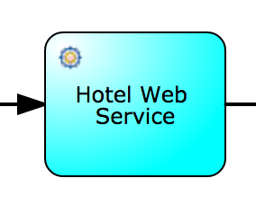

The _WebService Task Node_ is one of the 4 pre-defined "Service Tasks" in the JBoss BPMSuite platform. The service tasks allow for custom service task node implementations (backed by a WorkItemHandler implementation). Custom WorkItemHandlers are out-of-scope for this workshop, but more information on `WorkItemHandlers` can be found https://access.redhat.com/documentation/en-US/Red_Hat_JBoss_BPM_Suite/6.3/html/User_Guide/sect-Domain-specific_Tasks.html[here]

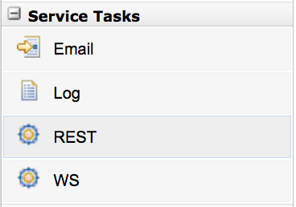

The _WebService Task Node_ has the following input and output variables. Input and output variable values are mapped from and to process variables (or static values).

Input:

* Url:  the URL of the WebService's WSDL.
* Mode: SYNC or ASYNC.
* Parameter: the webservice request.
* Namespace: the namespace of the service in the WSDL.	
* Interface: the name of the service in the WSDL.
* Operation: the service's operation we want to call.
* Endpoint (optianal): the webservice endpoint to call (this can be used when the endpoint defined in the WSDL is not the endpoint we want to call, for example when the webservice is hosted behind  load-balancer).

Output:

* Result: the result object of the webservice call. 

The _Data I/O_ editor, in which the input and output data mappings can be defined can be opened by selecting the WebService Task Node in the process, opening the properties panel and selecting the _Assignments_ field. This will open the following editor, which allows to edit the data input and output mapping for the current node.

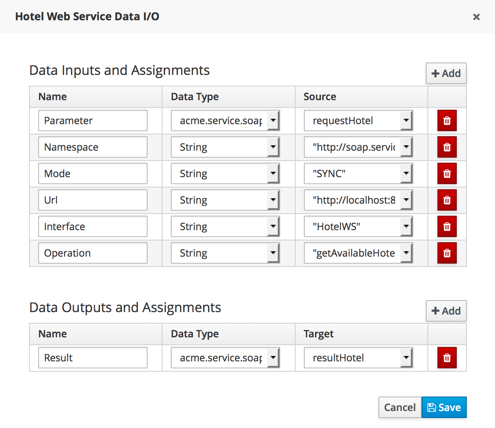

=== Rule Node

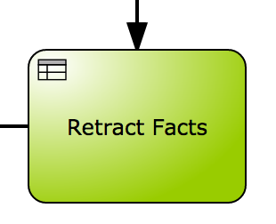

The _Rule Node_ is one of the Task nodes available in BPMN2 which allows one to execute business rules in BPMN2 node. In JBoss BPMSuite, the rule engine is provided by the embedded JBoss BRMS (Drools) runtime.
 
The _Rule Node_ is configured with a so called `ruleflow-group`. The `ruleflow-group` can be configured by clicking a _Rule Node_, opening the properties panel and selecting the _Ruleflow Group_ field. This will open the _Ruleflow Group_ editor.

=== Human Task Node

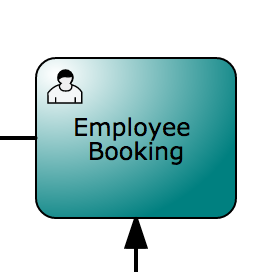

The _Human Task Node_ is another Task node available in BPMN2 which defines that the process requires human interaction. When a _Human Task Node_ is entered, the business process hits a so called _wait-state_, and will wait untill completion of the Human Task. When the human-task is completed, the process will continue.

As with the WebService Task Node, process variables can be mapped to and from a Human Task node, which allows human tasks to see and work with process data. The variable mapping is, as with the WebService Task Node, configured using the "Assignment" field in the property editor.

Human tasks need to have a unique name (which also controls their mapping to a human-task form). Human tasks can be assigned to an actor (user) or a list of actors, or to groups (or a list of groups). Only people with the given username or group membership are allowed to work on the task.

The JBoss BPMSuite Human Task engine is based on the WS-HumanTask standard. It provides features like delegation, escalation, re-assignment of tasks, etc. More information on the Human Task engine can be found [here]

== Subprocesses

Subprocess nodes allow to call a (reusable) subprocess from, or embed a subprocess in, the current process. The following subprocess nodes are supported in BPMSuite:

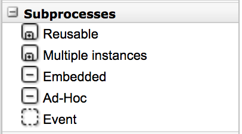

Depending on the type of sub-process, different properties will be available. In our workshop we will be using the _Reusable_ subprocess, which points to on of our other processes in our project (i.e. _calculatepriceprocess_ or _compensateService_). Again, properties can be edited by selecting the node and opening the properties panel. For a reusable subprocess, we need to set the "Called Element" to the _id_ of the process we want to call. Second, the _Assignments_ property allows us to define the input and output variable mapping from our main process to the subprocess.

=== Gateways

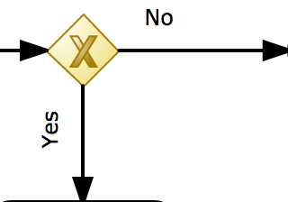

BPMN2 supports a number of different diverging and converging gateways:

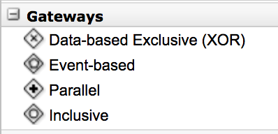

In this workshop we will be using 2 of the gateways, the _Data-based Exclusive_ (XOR) and the _Parallel_.

Gateways allow us to split a path into 2 or more (parallel) paths to accompany for parts of the process that can be executed in parallel (using for example the _parallel_ gateway) or to take different paths within the process based on data and/or decision logic (using for example _Data-based Exclusive_ gateways). Within the workshop we use both approaches.

The decision logic that determines which path to take in a diverging gateway is configured on the edges (sequence flows) leaving the gateway, not on the gateway node itself. The conditional logic can be configured by selecting an edge, opening the properties panel, and configuring the _Expression_ field. Note that the expression can be defined in:

* Drools: the rule language. The condition is defined as a Drools left-hand-side (LHS) constraint.
* Java: the condition is defined as a Java `return` statement which must return a boolean.
* Javascript: the condition is defined as a Javascript expression which must return a boolean.
* MVEL: the condition is defined as an MVEL expression which must return a boolean.

== Conclusion

In this lab we explored the pre-defined _specialtripsagencyprocess_ that will serve as the base for the remained of our workshop. We've discussed a number of the more widely used BPMN2 nodes and constructs and inspected their configuration. This has shows us the basic approach how to define BPMN2 business processes in JBoss BPMSuite and should be a solid base for the remained of this workshop.

