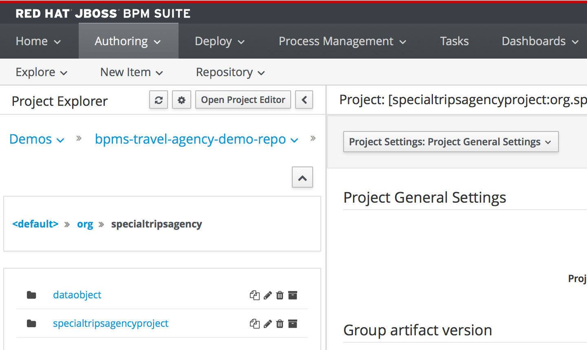
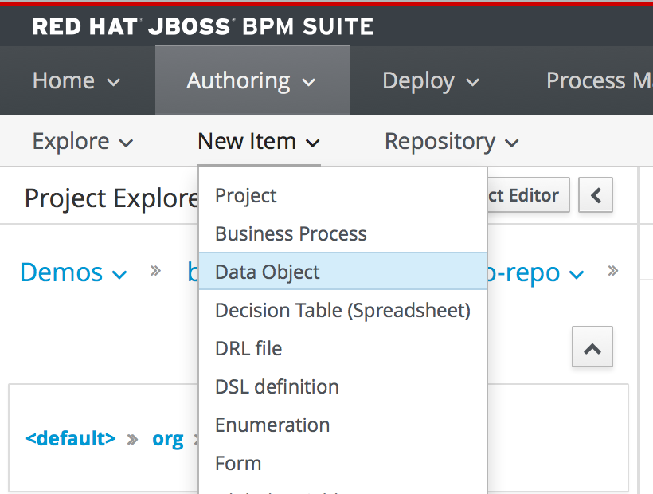
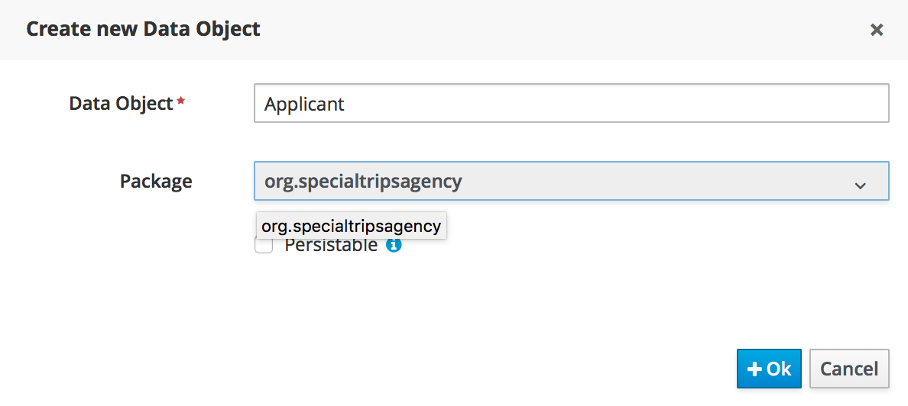
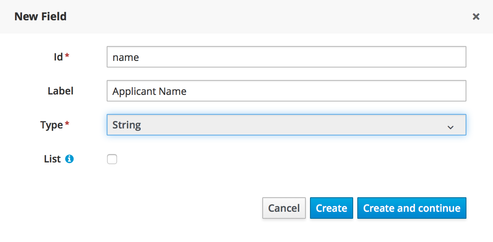
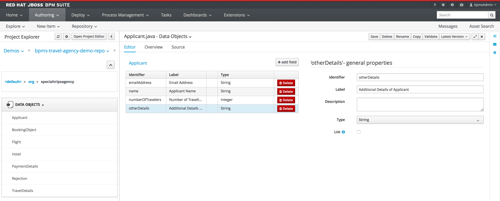

= JBoss BPMSuite 6.x Workshop Labs

== Lab 2: Data Modeler

In this lab we will complete the data-model required by the Travel Agency Demo by defining the 'Applicant' data-type using the the JBoss BPMSuite data-modeller.

=== Objectives
 
* Learn how to use the Data Model 
* Create a new 'Applicant' Data Object for the Travel Agency process.

== Package
Open Business-Central on your environment.

The data model of the demo is defined in the package 'org.specialtripsagency'. Open this package in the left panel of 'Project Authoring' view. Packages can be navigated by clicking on the icon with the downwards point arrow in the left-panel.

The package already contains some pre-defined data-types, like 'Flight', 'Hotel', 'Payment', etc. 

== Create the Data Object	

Once we've selected the correct package, we are going to add our new 'Applicant' datat type. The 'Applicant' defines the customer who is requesting a holiday booking. The 'Applicant' has the followign attributes:

* emailAddress, type:String, label: "Email Address"
* name, type:String, label: "Applicant Name"
* numberOfTravelers, type:Integer, label: "Number of Travellers" 
* otherDetails, type:String, label: "Additional Details of Applicant"

To define this new Data Object with the JBoss BPMSuite Data Modeler:

. Create a new Data Object by clicking on "New Item -> Data Object".

Complete the wizard.

[start=2]
. Add the first emailAddress field by clicking "add field" in the Data Modeler view. Add all fields listed earlier. When you want to add an additional field, click "Create and continue", when you dan't want to add another field, just click "Create".

[start=3]
. Click on the "Save" button to save the new Data Object to version control.

If all is correct, the fields of the new Data Object should look like this:

	
