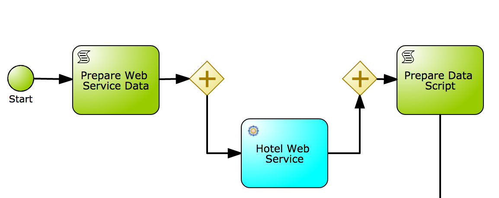
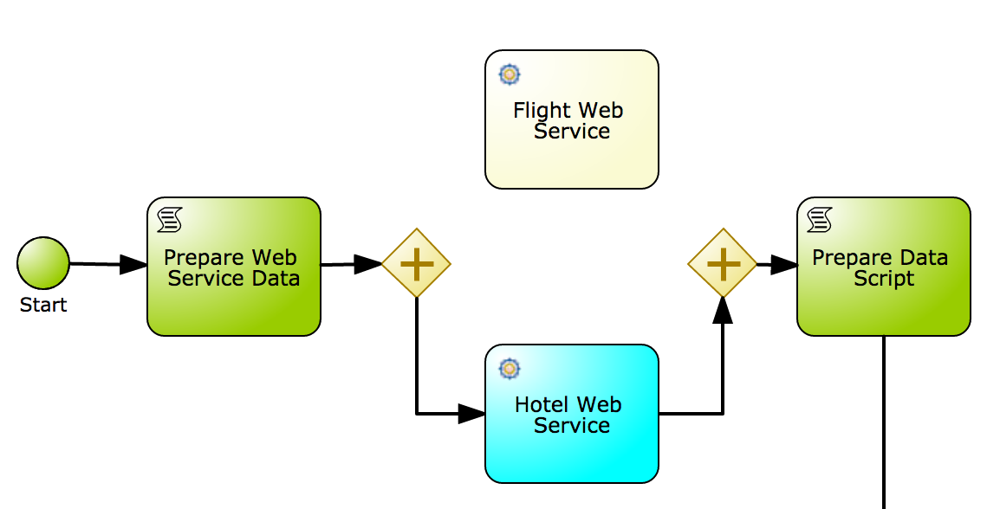
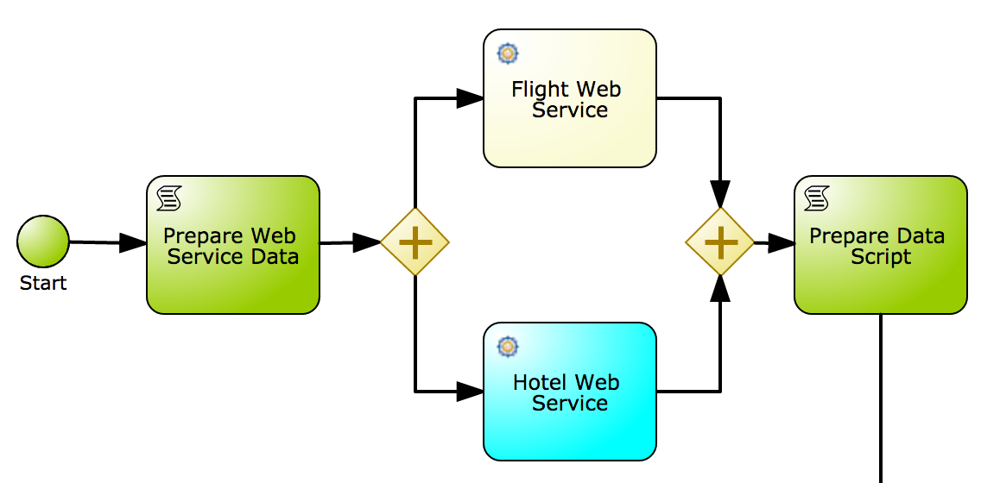
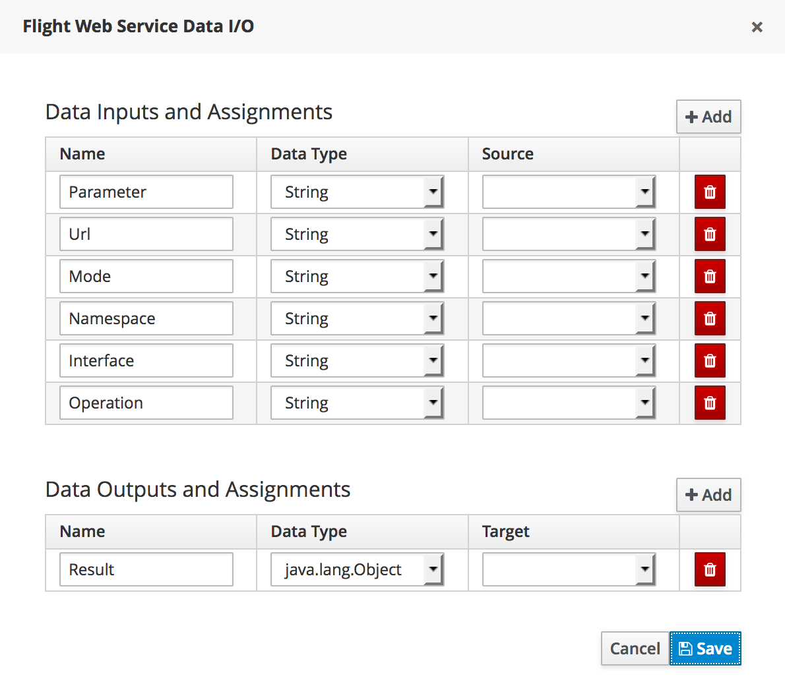
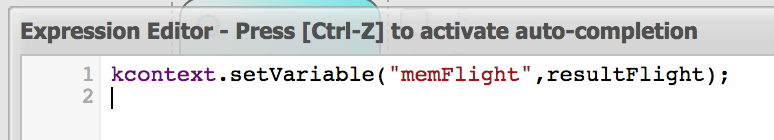
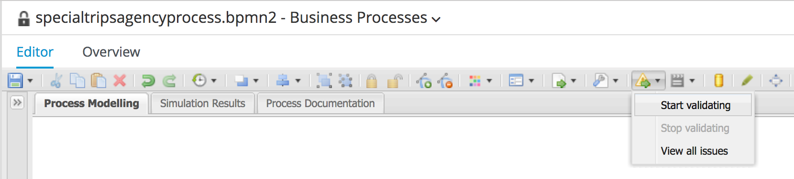

= JBoss BPMSuite 6.x Workshop Labs

== Lab 8: Implement WebService call

In this lab we will implement the WebService call from the JBoss BPMSuite process to the Flight WebService.

=== Objectives

* Learn how to use the JBoss BPMSuite WebServiceWorkItemHandler
* Learn how to map process data to WorkItemHandlers
* Learn how to call a WebService from a JBoss BPMSuite process

=== Introduction

The objective of the workshop is to start with a partly pre-defined process, as shown below.

image:images/lab7-initial-process.png["Travel Agency Demo process", 1024]

In the various labs we will complete this process until we have the completed process show below.

image:images/org.specialtripsagency.specialtripsagencyprocess.png["Travel Agency Demo process", 1024]

In this lab we will implement the node that does the WebService call to the flight web-service. This also requires us to implement a parallel gateway, as the Flight and Hotel service are independent of each other and can be called in parallel.

The Flight WebService has been deployed on the JBoss Enterprise Application Platform on your enviroment and can be accessed at: http://localhost:8080/acme-flight-service-1.0/AcmeDemoInterface?wsdl

== Implementing the WebService call
[start=1]
. The WebService call to the Flight Service will execute in parallel with the call to the Hotel Service which has already been defined in our process model. We therefore first need to add a diverging and converging parallel  gateway to our process.

[start=2]
. Next we drag the _WS_ node, which can be found in the _Service Tasks_ category in the palette onto the canvas. Give the node the name: "Flight Web Service"

[start=3]
. Connect the "Flight Web Service" node to the _inclusive_ diverging and converging gateways to complete the path.

[start=4]
. Configure the properties of the _Flight Web Service_ node. To do this, select the node and open the properties panel on the right of the editor. Click on the _Assignments_ field, which opens the _Flight Web Service Data I/O_ editor. Placeholders for the data mapping are already provided.

Set the following values to the assignments. Note that some of the assignments assign a constant `String` to the parameters, while other assignments assign a process variable (e.g. the _Parameter_ and _Result_ assignments).

.Data Input Assignments
|===
|Name |Data Type |Source

|Parameter
|com.jboss.soap.service.acmedemo.FlightRequest
|requestFlight

|Url
|String
|"http://localhost:8080/acme-flight-service-1.0/AcmeDemoInterface?wsdl"

|Mode
|String
|"SYNC"

|Namespace
|String
|"http://service.soap.jboss.com/AcmeDemo/"

|Interface
|String
|"AcmeDemoService"

|Operation
|String
|"listAvailablePlanes"
|===

.Data Output Assignments
|===
|Name |Data Type |Target

|Result
|com.jboss.soap.service.acmedemo.Flight
|resultFlight
|===

[start=5]
. We need to map the _resultFlight_ variable, the result of the webservice call back onto the variable _memFlight_ variable that we will use in the remainder of the process instance. We can do this in the "On Exit Actions" script of our "Flight Web Service" node. By clicking on the "On Exit Actions" property in the properties field, the script editor will open. Add the following Java code in the script editor:

----
kcontext.setVariable("memFlight",resultFlight);
----

[start=6]
. Finally, we can change the color of the new WS Task Node to match the color we use for WS Task Nodes in our model. Select the "Flight Web Service" node and open the properties panel. Click on the_Background Color_ field and select a color. To match the color of the Hotel Web Service, we use color "#00FFFF"

[start=7]
. Validate the process definition by starting the validator of the process designer.

[start=8]
. If the process is valid, save it by clicking on the _Save_ button in the upper rigth corner of the editor.

== Conclusion
In this lab we've added a call to the Flight Web Service to our process definition. We used the _parallel gateway_ to allow parallel execution of the _Flight Web Service_ and _Hotel Web Service_. We've connected  the node with the gateways, configured the _Data I/O_ mappings and changed the color of the nodes to match our coloring scheme.

In the next lab we will add a rules node and configure a _Data-based Exclusive_ gateway that takes a routing decision on data provided by the rules.
