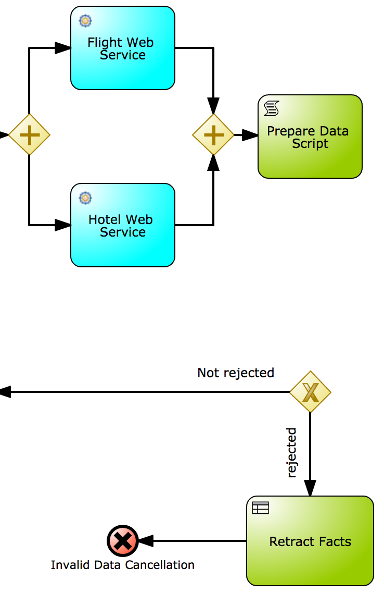
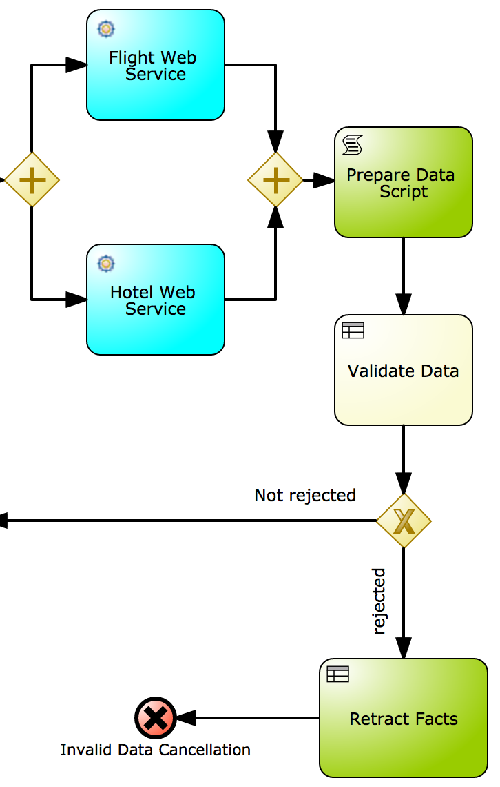
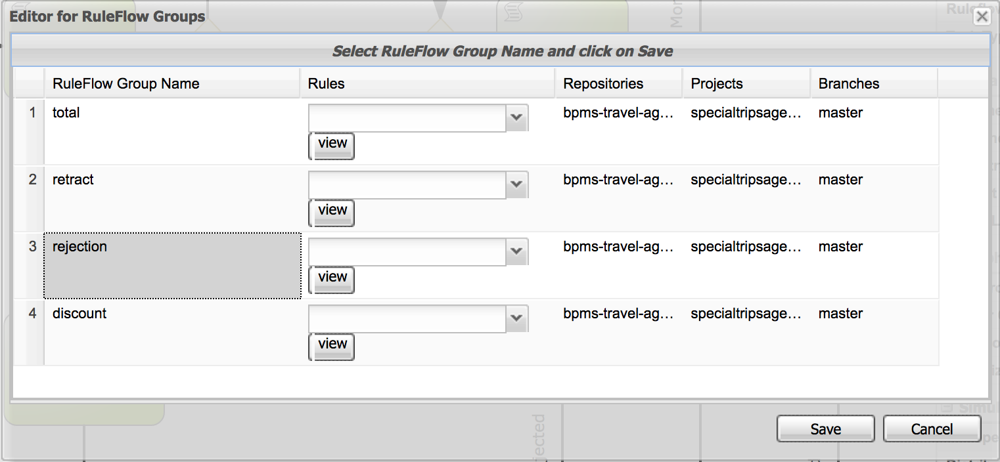
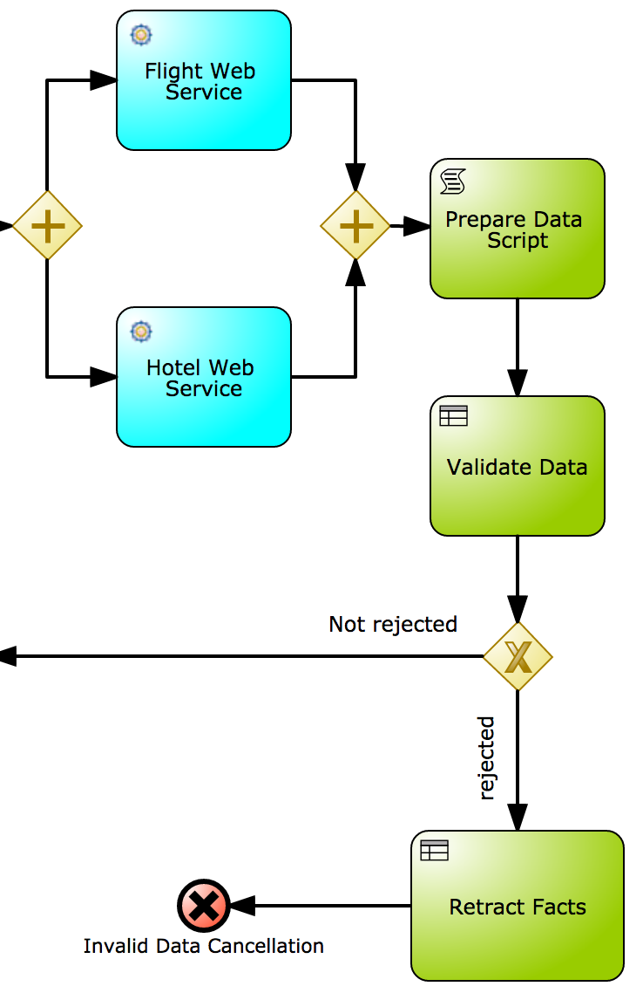

= JBoss BPMSuite 6.x Workshop Labs

== Lab 9: Implement Rule node and Data-based Exclusive Gateway

In this lab we will implement a Rule node which will execute/enable the _rejection_ rules, and a Data-based Exclusive gateway and sequence flow conditions that provides conditional routing within the process.

=== Objectives
 
* Learn how to use the JBoss BPMSuite Rule Node.
* Learn how to enable rule execution based on _ruleflow-groups_.
* Learn how to define conditions on sequence flows for conditional routing in processes.

== Introduction

In Lab 4 and 5 we implemented data validation rules in both the _Guided Rules_ format and in _DRL_ (technical rules) format. Both rules were configured to be in the _rejection_ ruleflow-group. The rules will validate the data and a `Rejection` fact (with a message) to the session, which can later be used in conditional routing. The task of this lab is therefore to add a _Rule Node_ which enables the _rejection_ ruleflow-group.

== Implementing the Rule Node

[start=1]
. We want to add the Rule Node after the _Prepare Data Script_, and before the Data-based Exclusive Gateway. First, we need to remove the connector between those 2 nodes.

[start=2]
. Add a _Business Rule_ node to the canvas and give it the name "Validate Data". The _Business Rule_ node can be found under the _Tasks_ category in the palette.

image:images/lab9-add-rule-node.png["Add Rule Node", 256]

[start=3]
. Connect the new _Rule Node_ to the _Prepare Data Script_ node and the _Data-based Exclusive Gateway_.

[start=4]
. Configure the ruleflow-group on the rule node. To do this, select the rule node and open the properties editor on the right hand side of the editor. Click on the _Ruleflow Group_ field. This will open the Ruleflow-Group editor. Select the _rejection_ ruleflow-group and click on the _Save_ button.

[start=5]
. Our rules operate on, so called, _facts_. These _facts_ need to be inserted into the session for the rules to be able to operate on them. There are various ways to add _facts_ to the sessi
on. We can, for example, use a script (either a script task or an on-entry script) to add the facts to the session. Another option is to use the input and output data-mapping of the rule-n
ode.

In this workshop we will use the latter option. Select the Rule Node and open the properties panel on the right-hand-side of the screen. Click on _Assignments_ to open the "Validate Data Data I/O" editor. Our rules in this ruleflow-group operate on the _facts_ `Applicant`, `TravelDetails` and `Flight`. Add these _facts_ to the rules session by configuring the following input and output mappings:

Data Input Assignments
|===
|Name |Data Type |Source

|_applicant
|org.specialtripsagency.Applicant
|applicant

|_travelDetails
|org.specialtripsagency.TravelDetails
|travelDetails

|_flight
|org.specialtripsagency.Flight
|Flight

|===

.Data Output Assignments
|===
|Name |Data Type |Target

|_applicant
|org.specialtripsagency.Applicant
|applicant

|_travelDetails
|org.specialtripsagency.TravelDetails
|travelDetails

|_flight
|org.specialtripsagency.Flight
|Flight
|===

Note that the output-mapping causes the facts to be removed from the rules-session (the name of the property needs to be the same as the name on the input parameter mapping for the fact to be removed). This is important if we want to clean-up our session after the rules have executed. Note that the rules run in the same stateful session as the process, which implies that any facts that we don't remove from the session can be seen by the next rules executed in the context of the process.

[start=6]
. Now that we've configured the Rule Node, we need to configure the decision logic in the sequence flows that go out of the _Data-based Exclusive_ gateway. The rules will insert a `Rejection` object if the data is not valid. We can check on the presence of that fact in the conditions of our sequence flow going out of the gateway. We can use a Drools conditional expression for this. Select the sequence flow named _rejected_ and open the properties panel. Make sure the _Condition Expression Language_ is set to "Drools". Next, click on the _Expression_ field and enter the following Drools condition:

[source, drl]
----
exists Rejection()
----

[start=7]
. The "Not rejected" sequence flow should be taken when there is not a `Rejection` fact present in the session. Select the sequence flow and open the properties panel. Make sure the _Condition Expression Language_ is set to "Drools". Click on the _Expression_ field and enter the following Drools condition:

[source, drl]
----
not Rejection()
----

[start=8]
. We can again change the color of the node, in this case our new Rule Node, to match the coloring scheme of our business process. In this case we will use color code "#99CC00".

[start=9]
. Validate the process and save it using the _Save_ button in the upper right corner of the editor.

== Conclusion

In this lab we've added a Rule Node that will execute our business rules and conditions on our gateway sequence flows that route our process based on the outcome of our rules.

In the next lab we will add a Subprocess Node which adds the calculation sub-process to our process definition.

